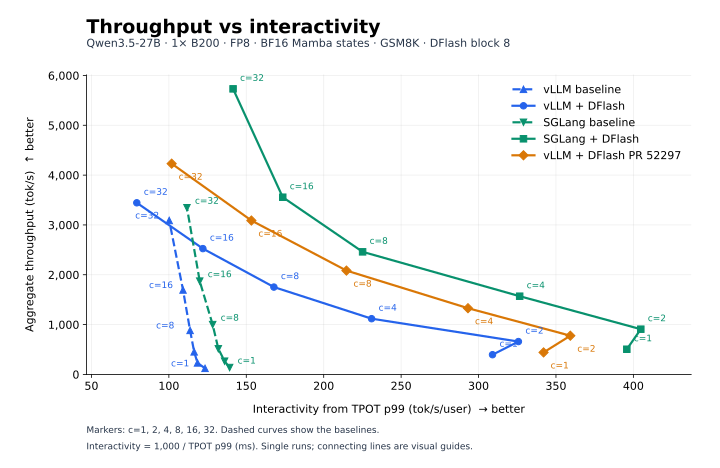
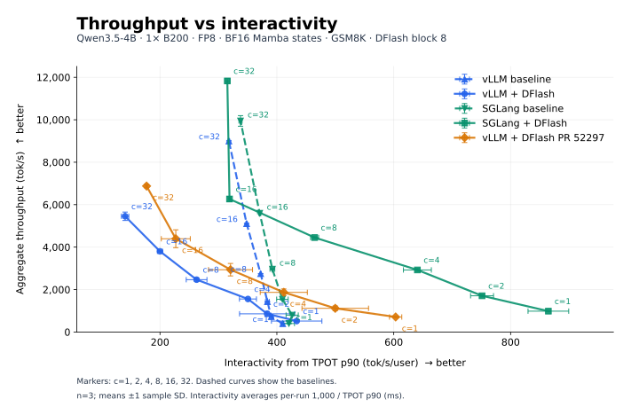
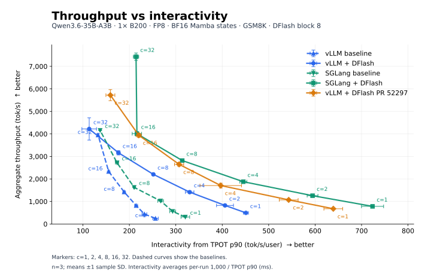

# B200 release comparison — DFlash block 8

[Open the tabbed HTML report](RESULTS.html).

Each table's Logs row links to Server logs and Bench logs, metric JSON exports, and configurations by concurrency. Bench also documents the source fields and formulas. Share the HTML, benchmark-logs.html, and model directories together.

- **Releases:** vLLM 0.30.0 (`ced6857afa0ea7b2e3f0846a62e1394e90f15607`); SGLang 0.5.20. Latest published releases checked on 2026-09-22.
- **PR2:** head `a8db1fe32ac19c2296bc0e9faedf9550ee56dd2d` merged with vLLM 0.30.0 as `63dc18cf5a93f69be959b2d2f3c26109ac693766`. Only PR2's four files differ; compiled kernels come from the release wheel.

- **Hardware and precision:** one NVIDIA B200 per run, TP=1, FP8 weights, BF16 compute and BF16 Mamba convolution/SSM states.
- **Server limits:** prefix caching disabled; memory fraction 0.92; 32 request slots; prefill chunk 2,048; maximum context 32,768.
- **CUDA graphs:** vLLM uses MRV2 and capture sizes through 512 tokens; SGLang uses its release-default graph policy.
- **DFlash:** 7 proposed tokens (SGLang block size 8); ReplaySSM is not enabled explicitly.
- **Acceptance length:** includes the bonus token. vLLM/PR use 1 + accepted draft tokens / draft iterations; SGLang uses the mean sampled acceptance-length gauge, with different weighting. Baselines are not applicable (—).
- **MoE comparison:** Qwen3.6-35B-A3B uses the same workload and 7 proposals as this matrix. The PR's original H200 experiment used ShareGPT and 8 proposals; this is not an exact reproduction.
- **MoE backend:** both SGLang MoE variants use Triton because release-default TRTLLM failed with missing FP8 input scales in the original block-16 sweep.
- **Draft backend:** vLLM and PR2 explicitly use `TRITON_ATTN`; SGLang also selects Triton. The original block-16 sweep's vLLM release-default FlashAttention draft backend failed on B200 with `No common block size for 336/480`.

- **Workload:** GSM8K, up to 256 output tokens, EOS and model sampling defaults enabled. Dense-model checkpoints match the pinned H100 experiments; all target/draft revisions are recorded per run.
- **Requests/warmups:** 100/10 at c=1, otherwise 20c/2c. Each variant reuses one server across ascending concurrency levels.
- **Execution:** variants run concurrently on separate reserved GPUs on a shared host, using up to seven benchmark GPUs.
- **Scope:** single runs without uncertainty estimates; reported separately from the historical H100 tables.

## 27B output tok/s

| c | vLLM | vLLM DFlash | SGLang | SGLang DFlash | vLLM + DFlash PR 52297 |
| ---: | ---: | ---: | ---: | ---: | ---: |
| 1 | 121.48 | 395.67 | 137.23 | 505.07 | 441.36 |
| 2 | 230.37 | 659.16 | 265.12 | 907.29 | 776.81 |
| 4 | 453.21 | 1,118.22 | 513.97 | 1,569.37 | 1,328.54 |
| 8 | 883.14 | 1,752.86 | 998.58 | 2,459.94 | 2,083.63 |
| 16 | 1,693.70 | 2,524.81 | 1,871.73 | 3,556.33 | 3,088.41 |
| 32 | 3,090.18 | 3,444.23 | 3,344.93 | 5,731.34 | 4,230.15 |
| Logs | [Server](27B/vllm_baseline/vllm_baseline/server.log) · [Bench](benchmark-logs.html#27B-vllm_baseline) | [Server](27B/vllm_dflash/vllm_dflash/server.log) · [Bench](benchmark-logs.html#27B-vllm_dflash) | [Server](27B/sglang_baseline/sglang_baseline/server.log) · [Bench](benchmark-logs.html#27B-sglang_baseline) | [Server](27B/sglang_dflash/sglang_dflash/server.log) · [Bench](benchmark-logs.html#27B-sglang_dflash) | [Server](27B/pr2_dflash/vllm_dflash/server.log) · [Bench](benchmark-logs.html#27B-pr2_dflash) |

## 27B ITL p99 (ms)

| c | vLLM | vLLM DFlash | SGLang | SGLang DFlash | vLLM + DFlash PR 52297 |
| ---: | ---: | ---: | ---: | ---: | ---: |
| 1 | 8.89 | 15.34 | 10.77 | 13.45 | 13.46 |
| 2 | 9.35 | 79.83 | 10.79 | 37.34 | 63.86 |
| 4 | 9.33 | 80.31 | 10.40 | 39.52 | 63.64 |
| 8 | 9.60 | 84.69 | 11.28 | 44.67 | 63.84 |
| 16 | 10.86 | 91.38 | 12.19 | 76.58 | 71.28 |
| 32 | 11.13 | 100.60 | 14.20 | 53.59 | 86.18 |
| Logs | [Server](27B/vllm_baseline/vllm_baseline/server.log) · [Bench](benchmark-logs.html#27B-vllm_baseline) | [Server](27B/vllm_dflash/vllm_dflash/server.log) · [Bench](benchmark-logs.html#27B-vllm_dflash) | [Server](27B/sglang_baseline/sglang_baseline/server.log) · [Bench](benchmark-logs.html#27B-sglang_baseline) | [Server](27B/sglang_dflash/sglang_dflash/server.log) · [Bench](benchmark-logs.html#27B-sglang_dflash) | [Server](27B/pr2_dflash/vllm_dflash/server.log) · [Bench](benchmark-logs.html#27B-pr2_dflash) |

## 27B TTFT p99 (ms)

| c | vLLM | vLLM DFlash | SGLang | SGLang DFlash | vLLM + DFlash PR 52297 |
| ---: | ---: | ---: | ---: | ---: | ---: |
| 1 | 47.61 | 67.69 | 42.28 | 46.48 | 74.48 |
| 2 | 91.47 | 155.01 | 68.04 | 78.70 | 112.63 |
| 4 | 114.99 | 243.98 | 64.96 | 83.21 | 162.55 |
| 8 | 111.85 | 249.69 | 81.06 | 96.80 | 188.65 |
| 16 | 166.69 | 250.75 | 88.20 | 100.51 | 265.68 |
| 32 | 174.18 | 293.20 | 135.59 | 401.12 | 261.87 |
| Logs | [Server](27B/vllm_baseline/vllm_baseline/server.log) · [Bench](benchmark-logs.html#27B-vllm_baseline) | [Server](27B/vllm_dflash/vllm_dflash/server.log) · [Bench](benchmark-logs.html#27B-vllm_dflash) | [Server](27B/sglang_baseline/sglang_baseline/server.log) · [Bench](benchmark-logs.html#27B-sglang_baseline) | [Server](27B/sglang_dflash/sglang_dflash/server.log) · [Bench](benchmark-logs.html#27B-sglang_dflash) | [Server](27B/pr2_dflash/vllm_dflash/server.log) · [Bench](benchmark-logs.html#27B-pr2_dflash) |

## 27B TPOT p99 (ms)

| c | vLLM | vLLM DFlash | SGLang | SGLang DFlash | vLLM + DFlash PR 52297 |
| ---: | ---: | ---: | ---: | ---: | ---: |
| 1 | 8.11 | 3.24 | 7.18 | 2.53 | 2.92 |
| 2 | 8.44 | 3.07 | 7.35 | 2.47 | 2.78 |
| 4 | 8.60 | 4.33 | 7.58 | 3.06 | 3.41 |
| 8 | 8.79 | 5.96 | 7.79 | 4.44 | 4.66 |
| 16 | 9.16 | 8.20 | 8.34 | 5.76 | 6.52 |
| 32 | 9.98 | 12.61 | 8.95 | 7.07 | 9.82 |
| Logs | [Server](27B/vllm_baseline/vllm_baseline/server.log) · [Bench](benchmark-logs.html#27B-vllm_baseline) | [Server](27B/vllm_dflash/vllm_dflash/server.log) · [Bench](benchmark-logs.html#27B-vllm_dflash) | [Server](27B/sglang_baseline/sglang_baseline/server.log) · [Bench](benchmark-logs.html#27B-sglang_baseline) | [Server](27B/sglang_dflash/sglang_dflash/server.log) · [Bench](benchmark-logs.html#27B-sglang_dflash) | [Server](27B/pr2_dflash/vllm_dflash/server.log) · [Bench](benchmark-logs.html#27B-pr2_dflash) |

## 27B Acceptance length (including bonus)

| c | vLLM | vLLM DFlash | SGLang | SGLang DFlash | vLLM + DFlash PR 52297 |
| ---: | ---: | ---: | ---: | ---: | ---: |
| 1 | — | 5.65 | — | 5.66 | 5.65 |
| 2 | — | 5.71 | — | 5.56 | 5.64 |
| 4 | — | 5.67 | — | 5.68 | 5.65 |
| 8 | — | 5.69 | — | 5.64 | 5.63 |
| 16 | — | 5.74 | — | 5.73 | 5.78 |
| 32 | — | 5.70 | — | 5.69 | 5.71 |
| Logs | [Server](27B/vllm_baseline/vllm_baseline/server.log) · [Bench](benchmark-logs.html#27B-vllm_baseline) | [Server](27B/vllm_dflash/vllm_dflash/server.log) · [Bench](benchmark-logs.html#27B-vllm_dflash) | [Server](27B/sglang_baseline/sglang_baseline/server.log) · [Bench](benchmark-logs.html#27B-sglang_baseline) | [Server](27B/sglang_dflash/sglang_dflash/server.log) · [Bench](benchmark-logs.html#27B-sglang_dflash) | [Server](27B/pr2_dflash/vllm_dflash/server.log) · [Bench](benchmark-logs.html#27B-pr2_dflash) |

## 27B Memory & capacity

| Metric | vLLM | vLLM DFlash | SGLang | SGLang DFlash | vLLM + DFlash PR 52297 |
| --- | ---: | ---: | ---: | ---: | ---: |
| Reported cache tokens | 2,134,931 | 1,413,914 | 2,140,480 | 1,300,975 | 1,413,914 |
| 128K seq equivalents (est.) | 16.29 | 10.79 | 16.33 | 9.93 | 10.79 |
| Configured request limit | 32 | 32 | 32 | 32 | 32 |
| Logs | [Server](27B/vllm_baseline/vllm_baseline/server.log) · [Bench](benchmark-logs.html#27B-vllm_baseline) | [Server](27B/vllm_dflash/vllm_dflash/server.log) · [Bench](benchmark-logs.html#27B-vllm_dflash) | [Server](27B/sglang_baseline/sglang_baseline/server.log) · [Bench](benchmark-logs.html#27B-sglang_baseline) | [Server](27B/sglang_dflash/sglang_dflash/server.log) · [Bench](benchmark-logs.html#27B-sglang_dflash) | [Server](27B/pr2_dflash/vllm_dflash/server.log) · [Bench](benchmark-logs.html#27B-pr2_dflash) |

128K = 131,072 tokens. Sequence equivalents = reported cache tokens / 131,072, not measured concurrency. These allocations come from servers configured for 32,768-token contexts and 32 request slots; reconfiguring for 128K may change capacity. No long-context measurements were run.

## 4B output tok/s

| c | vLLM | vLLM DFlash | SGLang | SGLang DFlash | vLLM + DFlash PR 52297 |
| ---: | ---: | ---: | ---: | ---: | ---: |
| 1 | 391.77 | 531.88 | 414.48 | 1,000.16 | 718.63 |
| 2 | 723.65 | 927.80 | 809.54 | 1,659.24 | 1,240.35 |
| 4 | 1,428.51 | 1,567.21 | 1,565.82 | 2,855.19 | 2,045.63 |
| 8 | 2,734.80 | 2,464.38 | 2,981.75 | 4,492.78 | 3,264.66 |
| 16 | 5,087.29 | 3,820.35 | 5,612.94 | 6,287.36 | 4,680.45 |
| 32 | 8,959.66 | 5,589.48 | 9,657.09 | 11,851.15 | 6,859.63 |
| Logs | [Server](4B/vllm_baseline/vllm_baseline/server.log) · [Bench](benchmark-logs.html#4B-vllm_baseline) | [Server](4B/vllm_dflash/vllm_dflash/server.log) · [Bench](benchmark-logs.html#4B-vllm_dflash) | [Server](4B/sglang_baseline/sglang_baseline/server.log) · [Bench](benchmark-logs.html#4B-sglang_baseline) | [Server](4B/sglang_dflash/sglang_dflash/server.log) · [Bench](benchmark-logs.html#4B-sglang_dflash) | [Server](4B/pr2_dflash/vllm_dflash/server.log) · [Bench](benchmark-logs.html#4B-pr2_dflash) |

## 4B ITL p99 (ms)

| c | vLLM | vLLM DFlash | SGLang | SGLang DFlash | vLLM + DFlash PR 52297 |
| ---: | ---: | ---: | ---: | ---: | ---: |
| 1 | 3.27 | 9.25 | 3.05 | 7.58 | 8.49 |
| 2 | 3.34 | 46.64 | 3.17 | 22.28 | 37.02 |
| 4 | 3.46 | 47.09 | 3.60 | 23.21 | 38.65 |
| 8 | 3.65 | 48.92 | 3.97 | 28.84 | 41.08 |
| 16 | 4.30 | 51.86 | 5.23 | 33.28 | 44.04 |
| 32 | 5.19 | 51.93 | 8.08 | 25.59 | 45.37 |
| Logs | [Server](4B/vllm_baseline/vllm_baseline/server.log) · [Bench](benchmark-logs.html#4B-vllm_baseline) | [Server](4B/vllm_dflash/vllm_dflash/server.log) · [Bench](benchmark-logs.html#4B-vllm_dflash) | [Server](4B/sglang_baseline/sglang_baseline/server.log) · [Bench](benchmark-logs.html#4B-sglang_baseline) | [Server](4B/sglang_dflash/sglang_dflash/server.log) · [Bench](benchmark-logs.html#4B-sglang_dflash) | [Server](4B/pr2_dflash/vllm_dflash/server.log) · [Bench](benchmark-logs.html#4B-pr2_dflash) |

## 4B TTFT p99 (ms)

| c | vLLM | vLLM DFlash | SGLang | SGLang DFlash | vLLM + DFlash PR 52297 |
| ---: | ---: | ---: | ---: | ---: | ---: |
| 1 | 36.51 | 47.46 | 33.59 | 34.09 | 47.45 |
| 2 | 65.24 | 86.18 | 52.85 | 58.69 | 84.75 |
| 4 | 61.25 | 104.41 | 63.11 | 63.56 | 96.23 |
| 8 | 91.95 | 126.72 | 50.86 | 65.48 | 110.55 |
| 16 | 85.02 | 145.54 | 55.89 | 73.77 | 123.85 |
| 32 | 144.35 | 177.45 | 109.67 | 163.95 | 157.00 |
| Logs | [Server](4B/vllm_baseline/vllm_baseline/server.log) · [Bench](benchmark-logs.html#4B-vllm_baseline) | [Server](4B/vllm_dflash/vllm_dflash/server.log) · [Bench](benchmark-logs.html#4B-vllm_dflash) | [Server](4B/sglang_baseline/sglang_baseline/server.log) · [Bench](benchmark-logs.html#4B-sglang_baseline) | [Server](4B/sglang_dflash/sglang_dflash/server.log) · [Bench](benchmark-logs.html#4B-sglang_dflash) | [Server](4B/pr2_dflash/vllm_dflash/server.log) · [Bench](benchmark-logs.html#4B-pr2_dflash) |

## 4B TPOT p99 (ms)

| c | vLLM | vLLM DFlash | SGLang | SGLang DFlash | vLLM + DFlash PR 52297 |
| ---: | ---: | ---: | ---: | ---: | ---: |
| 1 | 2.46 | 2.56 | 2.34 | 1.34 | 1.92 |
| 2 | 2.56 | 2.79 | 2.31 | 1.54 | 1.91 |
| 4 | 2.60 | 3.28 | 2.42 | 1.99 | 2.62 |
| 8 | 2.69 | 4.53 | 2.55 | 2.50 | 3.63 |
| 16 | 2.93 | 6.23 | 2.70 | 3.89 | 5.01 |
| 32 | 3.21 | 8.74 | 3.36 | 3.78 | 7.11 |
| Logs | [Server](4B/vllm_baseline/vllm_baseline/server.log) · [Bench](benchmark-logs.html#4B-vllm_baseline) | [Server](4B/vllm_dflash/vllm_dflash/server.log) · [Bench](benchmark-logs.html#4B-vllm_dflash) | [Server](4B/sglang_baseline/sglang_baseline/server.log) · [Bench](benchmark-logs.html#4B-sglang_baseline) | [Server](4B/sglang_dflash/sglang_dflash/server.log) · [Bench](benchmark-logs.html#4B-sglang_dflash) | [Server](4B/pr2_dflash/vllm_dflash/server.log) · [Bench](benchmark-logs.html#4B-pr2_dflash) |

## 4B Acceptance length (including bonus)

| c | vLLM | vLLM DFlash | SGLang | SGLang DFlash | vLLM + DFlash PR 52297 |
| ---: | ---: | ---: | ---: | ---: | ---: |
| 1 | — | 4.62 | — | 4.75 | 4.62 |
| 2 | — | 4.61 | — | 4.40 | 4.57 |
| 4 | — | 4.58 | — | 4.31 | 4.51 |
| 8 | — | 4.55 | — | 4.66 | 4.60 |
| 16 | — | 4.67 | — | 4.61 | 4.51 |
| 32 | — | 4.63 | — | 4.53 | 4.62 |
| Logs | [Server](4B/vllm_baseline/vllm_baseline/server.log) · [Bench](benchmark-logs.html#4B-vllm_baseline) | [Server](4B/vllm_dflash/vllm_dflash/server.log) · [Bench](benchmark-logs.html#4B-vllm_dflash) | [Server](4B/sglang_baseline/sglang_baseline/server.log) · [Bench](benchmark-logs.html#4B-sglang_baseline) | [Server](4B/sglang_dflash/sglang_dflash/server.log) · [Bench](benchmark-logs.html#4B-sglang_dflash) | [Server](4B/pr2_dflash/vllm_dflash/server.log) · [Bench](benchmark-logs.html#4B-pr2_dflash) |

## 4B Memory & capacity

| Metric | vLLM | vLLM DFlash | SGLang | SGLang DFlash | vLLM + DFlash PR 52297 |
| --- | ---: | ---: | ---: | ---: | ---: |
| Reported cache tokens | 5,037,287 | 3,369,399 | 5,128,384 | 2,795,991 | 3,369,399 |
| 128K seq equivalents (est.) | 38.43 | 25.71 | 39.13 | 21.33 | 25.71 |
| Configured request limit | 32 | 32 | 32 | 32 | 32 |
| Logs | [Server](4B/vllm_baseline/vllm_baseline/server.log) · [Bench](benchmark-logs.html#4B-vllm_baseline) | [Server](4B/vllm_dflash/vllm_dflash/server.log) · [Bench](benchmark-logs.html#4B-vllm_dflash) | [Server](4B/sglang_baseline/sglang_baseline/server.log) · [Bench](benchmark-logs.html#4B-sglang_baseline) | [Server](4B/sglang_dflash/sglang_dflash/server.log) · [Bench](benchmark-logs.html#4B-sglang_dflash) | [Server](4B/pr2_dflash/vllm_dflash/server.log) · [Bench](benchmark-logs.html#4B-pr2_dflash) |

128K = 131,072 tokens. Sequence equivalents = reported cache tokens / 131,072, not measured concurrency. These allocations come from servers configured for 32,768-token contexts and 32 request slots; reconfiguring for 128K may change capacity. No long-context measurements were run.

## 35B-A3B output tok/s

| c | vLLM | vLLM DFlash | SGLang | SGLang DFlash | vLLM + DFlash PR 52297 |
| ---: | ---: | ---: | ---: | ---: | ---: |
| 1 | 241.62 | 499.99 | 300.04 | 794.96 | 681.98 |
| 2 | 429.52 | 840.44 | 546.35 | 1,272.14 | 1,093.93 |
| 4 | 807.51 | 1,452.76 | 998.00 | 1,901.12 | 1,733.84 |
| 8 | 1,406.26 | 2,168.56 | 1,616.62 | 2,832.18 | 2,644.05 |
| 16 | 2,309.30 | 3,055.08 | 2,723.71 | 4,061.70 | 3,981.25 |
| 32 | 3,914.73 | 4,644.51 | 4,152.31 | 7,459.87 | 5,489.47 |
| Logs | [Server](35B-A3B/vllm_baseline/vllm_baseline/server.log) · [Bench](benchmark-logs.html#35B-A3B-vllm_baseline) | [Server](35B-A3B/vllm_dflash/vllm_dflash/server.log) · [Bench](benchmark-logs.html#35B-A3B-vllm_dflash) | [Server](35B-A3B/sglang_baseline/sglang_baseline/server.log) · [Bench](benchmark-logs.html#35B-A3B-sglang_baseline) | [Server](35B-A3B/sglang_dflash/sglang_dflash/server.log) · [Bench](benchmark-logs.html#35B-A3B-sglang_dflash) | [Server](35B-A3B/pr2_dflash/vllm_dflash/server.log) · [Bench](benchmark-logs.html#35B-A3B-pr2_dflash) |

## 35B-A3B ITL p99 (ms)

| c | vLLM | vLLM DFlash | SGLang | SGLang DFlash | vLLM + DFlash PR 52297 |
| ---: | ---: | ---: | ---: | ---: | ---: |
| 1 | 4.77 | 13.03 | 5.77 | 8.85 | 9.06 |
| 2 | 5.18 | 56.02 | 6.56 | 28.16 | 45.27 |
| 4 | 5.57 | 56.34 | 7.17 | 30.53 | 49.56 |
| 8 | 6.44 | 62.35 | 8.55 | 35.92 | 46.57 |
| 16 | 8.32 | 66.70 | 9.75 | 48.18 | 46.96 |
| 32 | 9.76 | 73.16 | 12.33 | 38.49 | 55.52 |
| Logs | [Server](35B-A3B/vllm_baseline/vllm_baseline/server.log) · [Bench](benchmark-logs.html#35B-A3B-vllm_baseline) | [Server](35B-A3B/vllm_dflash/vllm_dflash/server.log) · [Bench](benchmark-logs.html#35B-A3B-vllm_dflash) | [Server](35B-A3B/sglang_baseline/sglang_baseline/server.log) · [Bench](benchmark-logs.html#35B-A3B-sglang_baseline) | [Server](35B-A3B/sglang_dflash/sglang_dflash/server.log) · [Bench](benchmark-logs.html#35B-A3B-sglang_dflash) | [Server](35B-A3B/pr2_dflash/vllm_dflash/server.log) · [Bench](benchmark-logs.html#35B-A3B-pr2_dflash) |

## 35B-A3B TTFT p99 (ms)

| c | vLLM | vLLM DFlash | SGLang | SGLang DFlash | vLLM + DFlash PR 52297 |
| ---: | ---: | ---: | ---: | ---: | ---: |
| 1 | 47.93 | 59.09 | 37.70 | 37.15 | 76.11 |
| 2 | 75.57 | 102.54 | 67.45 | 66.33 | 91.27 |
| 4 | 77.83 | 130.67 | 61.58 | 67.07 | 142.39 |
| 8 | 126.79 | 171.50 | 66.61 | 69.44 | 114.69 |
| 16 | 172.50 | 881.83 | 80.95 | 81.99 | 169.43 |
| 32 | 208.30 | 245.02 | 95.73 | 263.57 | 218.34 |
| Logs | [Server](35B-A3B/vllm_baseline/vllm_baseline/server.log) · [Bench](benchmark-logs.html#35B-A3B-vllm_baseline) | [Server](35B-A3B/vllm_dflash/vllm_dflash/server.log) · [Bench](benchmark-logs.html#35B-A3B-vllm_dflash) | [Server](35B-A3B/sglang_baseline/sglang_baseline/server.log) · [Bench](benchmark-logs.html#35B-A3B-sglang_baseline) | [Server](35B-A3B/sglang_dflash/sglang_dflash/server.log) · [Bench](benchmark-logs.html#35B-A3B-sglang_dflash) | [Server](35B-A3B/pr2_dflash/vllm_dflash/server.log) · [Bench](benchmark-logs.html#35B-A3B-pr2_dflash) |

## 35B-A3B TPOT p99 (ms)

| c | vLLM | vLLM DFlash | SGLang | SGLang DFlash | vLLM + DFlash PR 52297 |
| ---: | ---: | ---: | ---: | ---: | ---: |
| 1 | 4.02 | 2.46 | 3.25 | 1.62 | 1.74 |
| 2 | 4.43 | 2.79 | 3.48 | 1.82 | 2.19 |
| 4 | 4.74 | 3.42 | 3.85 | 2.80 | 2.85 |
| 8 | 5.39 | 5.17 | 4.86 | 3.93 | 3.81 |
| 16 | 6.52 | 6.79 | 5.72 | 5.66 | 5.62 |
| 32 | 7.91 | 9.41 | 7.35 | 5.92 | 8.42 |
| Logs | [Server](35B-A3B/vllm_baseline/vllm_baseline/server.log) · [Bench](benchmark-logs.html#35B-A3B-vllm_baseline) | [Server](35B-A3B/vllm_dflash/vllm_dflash/server.log) · [Bench](benchmark-logs.html#35B-A3B-vllm_dflash) | [Server](35B-A3B/sglang_baseline/sglang_baseline/server.log) · [Bench](benchmark-logs.html#35B-A3B-sglang_baseline) | [Server](35B-A3B/sglang_dflash/sglang_dflash/server.log) · [Bench](benchmark-logs.html#35B-A3B-sglang_dflash) | [Server](35B-A3B/pr2_dflash/vllm_dflash/server.log) · [Bench](benchmark-logs.html#35B-A3B-pr2_dflash) |

## 35B-A3B Acceptance length (including bonus)

| c | vLLM | vLLM DFlash | SGLang | SGLang DFlash | vLLM + DFlash PR 52297 |
| ---: | ---: | ---: | ---: | ---: | ---: |
| 1 | — | 5.25 | — | 5.11 | 5.25 |
| 2 | — | 5.18 | — | 5.36 | 5.23 |
| 4 | — | 5.14 | — | 5.21 | 5.18 |
| 8 | — | 5.21 | — | 5.17 | 5.23 |
| 16 | — | 5.21 | — | 5.18 | 5.19 |
| 32 | — | 5.20 | — | 5.20 | 5.21 |
| Logs | [Server](35B-A3B/vllm_baseline/vllm_baseline/server.log) · [Bench](benchmark-logs.html#35B-A3B-vllm_baseline) | [Server](35B-A3B/vllm_dflash/vllm_dflash/server.log) · [Bench](benchmark-logs.html#35B-A3B-vllm_dflash) | [Server](35B-A3B/sglang_baseline/sglang_baseline/server.log) · [Bench](benchmark-logs.html#35B-A3B-sglang_baseline) | [Server](35B-A3B/sglang_dflash/sglang_dflash/server.log) · [Bench](benchmark-logs.html#35B-A3B-sglang_dflash) | [Server](35B-A3B/pr2_dflash/vllm_dflash/server.log) · [Bench](benchmark-logs.html#35B-A3B-pr2_dflash) |

## 35B-A3B Memory & capacity

| Metric | vLLM | vLLM DFlash | SGLang | SGLang DFlash | vLLM + DFlash PR 52297 |
| --- | ---: | ---: | ---: | ---: | ---: |
| Reported cache tokens | 6,380,032 | 2,838,836 | 6,697,728 | 2,841,513 | 2,838,836 |
| 128K seq equivalents (est.) | 48.68 | 21.66 | 51.10 | 21.68 | 21.66 |
| Configured request limit | 32 | 32 | 32 | 32 | 32 |
| Logs | [Server](35B-A3B/vllm_baseline/vllm_baseline/server.log) · [Bench](benchmark-logs.html#35B-A3B-vllm_baseline) | [Server](35B-A3B/vllm_dflash/vllm_dflash/server.log) · [Bench](benchmark-logs.html#35B-A3B-vllm_dflash) | [Server](35B-A3B/sglang_baseline/sglang_baseline/server.log) · [Bench](benchmark-logs.html#35B-A3B-sglang_baseline) | [Server](35B-A3B/sglang_dflash/sglang_dflash/server.log) · [Bench](benchmark-logs.html#35B-A3B-sglang_dflash) | [Server](35B-A3B/pr2_dflash/vllm_dflash/server.log) · [Bench](benchmark-logs.html#35B-A3B-pr2_dflash) |

128K = 131,072 tokens. Sequence equivalents = reported cache tokens / 131,072, not measured concurrency. These allocations come from servers configured for 32,768-token contexts and 32 request slots; reconfiguring for 128K may change capacity. No long-context measurements were run.

- **Completed:** 90/90 benchmark points. A dash indicates an unavailable or inapplicable metric.
- **Artifacts:** per-run commands, versions, GPU identifiers, metrics and logs are in the model/variant directories.
- **Environment:** see `environment.json` for dependency versions and source revisions.

## 27B throughput vs interactivity

Interactivity = 1,000 / TPOT p99 (ms). Dashed curves show the baselines.

## 4B throughput vs interactivity

Interactivity = 1,000 / TPOT p99 (ms). Dashed curves show the baselines.

## 35B-A3B throughput vs interactivity

Interactivity = 1,000 / TPOT p99 (ms). Dashed curves show the baselines.
