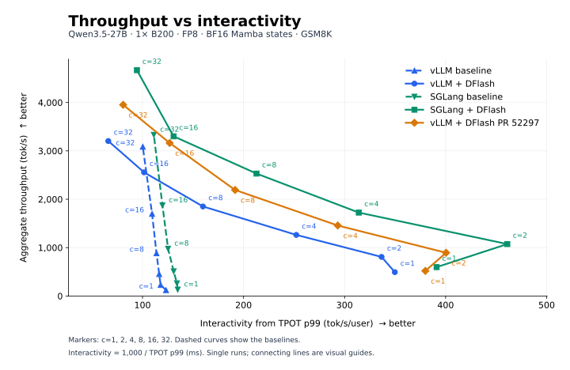
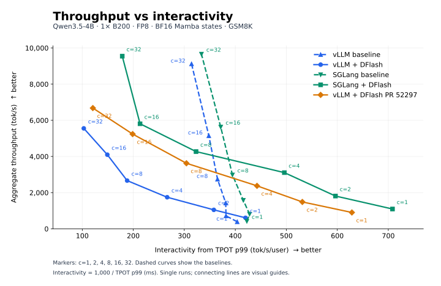
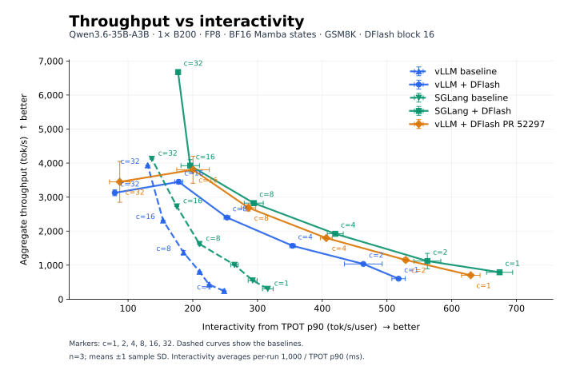

# B200 release comparison — DFlash block 16

[Open the tabbed HTML report](RESULTS.html).

Each table's Logs row links to Server logs and Bench logs, metric JSON exports, and configurations by concurrency. Bench also documents the source fields and formulas. Share the HTML, benchmark-logs.html, and model directories together.

- **Releases:** vLLM 0.30.0 (`ced6857afa0ea7b2e3f0846a62e1394e90f15607`); SGLang 0.5.20. Latest published releases checked on 2026-09-22.
- **PR2:** head `a8db1fe32ac19c2296bc0e9faedf9550ee56dd2d` merged with vLLM 0.30.0 as `63dc18cf5a93f69be959b2d2f3c26109ac693766`. Only PR2's four files differ; compiled kernels come from the release wheel.

- **Hardware and precision:** one NVIDIA B200 per run, TP=1, FP8 weights, BF16 compute and BF16 Mamba convolution/SSM states.
- **Server limits:** prefix caching disabled; memory fraction 0.92; 32 request slots; prefill chunk 2,048; maximum context 32,768.
- **CUDA graphs:** vLLM uses MRV2 and capture sizes through 512 tokens; SGLang uses its release-default graph policy.
- **DFlash:** 15 proposed tokens (SGLang block size 16); ReplaySSM is not enabled explicitly.
- **Acceptance length:** includes the bonus token. vLLM/PR use 1 + accepted draft tokens / draft iterations; SGLang uses the mean sampled acceptance-length gauge, with different weighting. Baselines are not applicable (—).
- **MoE comparison:** Qwen3.6-35B-A3B uses the same workload and 15 proposals as this matrix. The PR's original H200 experiment used ShareGPT and 8 proposals; this is not an exact reproduction.
- **MoE backend:** both SGLang MoE variants use Triton because release-default TRTLLM failed with missing FP8 input scales in the original block-16 sweep.
- **Draft backend:** vLLM and PR2 explicitly use `TRITON_ATTN`; SGLang also selects Triton. The original block-16 sweep's vLLM release-default FlashAttention draft backend failed on B200 with `No common block size for 336/480`.

- **Workload:** GSM8K, up to 256 output tokens, EOS and model sampling defaults enabled. Dense-model checkpoints match the pinned H100 experiments; all target/draft revisions are recorded per run.
- **Requests/warmups:** 100/10 at c=1, otherwise 20c/2c. Each variant reuses one server across ascending concurrency levels.
- **Execution:** variants run concurrently on separate reserved GPUs on a shared host, using up to seven benchmark GPUs.
- **Scope:** single runs without uncertainty estimates; reported separately from the historical H100 tables.

[SGLang verification findings](SGLANG_VERIFICATION.md).

## 27B output tok/s

| c | vLLM | vLLM DFlash | SGLang | SGLang DFlash | vLLM + DFlash PR 52297 |
| ---: | ---: | ---: | ---: | ---: | ---: |
| 1 | 121.53 | 493.19 | 132.93 | 597.00 | 519.38 |
| 2 | 229.59 | 808.17 | 262.14 | 1,073.78 | 893.94 |
| 4 | 453.49 | 1,263.00 | 509.73 | 1,724.21 | 1,457.00 |
| 8 | 883.45 | 1,850.74 | 977.52 | 2,530.46 | 2,191.41 |
| 16 | 1,698.77 | 2,556.29 | 1,872.77 | 3,300.47 | 3,162.82 |
| 32 | 3,085.51 | 3,203.37 | 3,331.81 | 4,667.50 | 3,952.41 |
| Logs | [Server](27B/vllm_baseline/vllm_baseline/server.log) · [Bench](benchmark-logs.html#27B-vllm_baseline) | [Server](27B/vllm_dflash/vllm_dflash/server.log) · [Bench](benchmark-logs.html#27B-vllm_dflash) | [Server](27B/sglang_baseline/sglang_baseline/server.log) · [Bench](benchmark-logs.html#27B-sglang_baseline) | [Server](27B/sglang_dflash/sglang_dflash/server.log) · [Bench](benchmark-logs.html#27B-sglang_dflash) | [Server](27B/pr2_dflash/vllm_dflash/server.log) · [Bench](benchmark-logs.html#27B-pr2_dflash) |

## 27B ITL p99 (ms)

| c | vLLM | vLLM DFlash | SGLang | SGLang DFlash | vLLM + DFlash PR 52297 |
| ---: | ---: | ---: | ---: | ---: | ---: |
| 1 | 8.66 | 16.06 | 10.98 | 14.41 | 13.48 |
| 2 | 9.29 | 80.09 | 10.80 | 40.40 | 60.22 |
| 4 | 9.18 | 81.27 | 11.11 | 43.53 | 62.84 |
| 8 | 9.40 | 90.71 | 10.90 | 49.04 | 68.95 |
| 16 | 9.95 | 89.97 | 11.59 | 87.74 | 69.30 |
| 32 | 12.08 | 116.43 | 12.85 | 71.70 | 97.47 |
| Logs | [Server](27B/vllm_baseline/vllm_baseline/server.log) · [Bench](benchmark-logs.html#27B-vllm_baseline) | [Server](27B/vllm_dflash/vllm_dflash/server.log) · [Bench](benchmark-logs.html#27B-vllm_dflash) | [Server](27B/sglang_baseline/sglang_baseline/server.log) · [Bench](benchmark-logs.html#27B-sglang_baseline) | [Server](27B/sglang_dflash/sglang_dflash/server.log) · [Bench](benchmark-logs.html#27B-sglang_dflash) | [Server](27B/pr2_dflash/vllm_dflash/server.log) · [Bench](benchmark-logs.html#27B-pr2_dflash) |

## 27B TTFT p99 (ms)

| c | vLLM | vLLM DFlash | SGLang | SGLang DFlash | vLLM + DFlash PR 52297 |
| ---: | ---: | ---: | ---: | ---: | ---: |
| 1 | 39.14 | 75.78 | 41.75 | 48.70 | 66.93 |
| 2 | 131.51 | 147.84 | 69.12 | 77.44 | 122.48 |
| 4 | 85.75 | 175.71 | 67.97 | 87.18 | 167.77 |
| 8 | 91.37 | 204.67 | 71.53 | 97.77 | 187.97 |
| 16 | 106.63 | 267.24 | 86.91 | 112.46 | 192.46 |
| 32 | 230.33 | 349.20 | 134.20 | 436.00 | 284.64 |
| Logs | [Server](27B/vllm_baseline/vllm_baseline/server.log) · [Bench](benchmark-logs.html#27B-vllm_baseline) | [Server](27B/vllm_dflash/vllm_dflash/server.log) · [Bench](benchmark-logs.html#27B-vllm_dflash) | [Server](27B/sglang_baseline/sglang_baseline/server.log) · [Bench](benchmark-logs.html#27B-sglang_baseline) | [Server](27B/sglang_dflash/sglang_dflash/server.log) · [Bench](benchmark-logs.html#27B-sglang_dflash) | [Server](27B/pr2_dflash/vllm_dflash/server.log) · [Bench](benchmark-logs.html#27B-pr2_dflash) |

## 27B TPOT p99 (ms)

| c | vLLM | vLLM DFlash | SGLang | SGLang DFlash | vLLM + DFlash PR 52297 |
| ---: | ---: | ---: | ---: | ---: | ---: |
| 1 | 8.12 | 2.86 | 7.42 | 2.56 | 2.63 |
| 2 | 8.48 | 2.97 | 7.46 | 2.17 | 2.50 |
| 4 | 8.58 | 3.97 | 7.64 | 3.18 | 3.41 |
| 8 | 8.79 | 6.26 | 7.98 | 4.70 | 5.22 |
| 16 | 9.14 | 9.85 | 8.35 | 7.65 | 7.88 |
| 32 | 9.97 | 15.12 | 9.00 | 10.59 | 12.37 |
| Logs | [Server](27B/vllm_baseline/vllm_baseline/server.log) · [Bench](benchmark-logs.html#27B-vllm_baseline) | [Server](27B/vllm_dflash/vllm_dflash/server.log) · [Bench](benchmark-logs.html#27B-vllm_dflash) | [Server](27B/sglang_baseline/sglang_baseline/server.log) · [Bench](benchmark-logs.html#27B-sglang_baseline) | [Server](27B/sglang_dflash/sglang_dflash/server.log) · [Bench](benchmark-logs.html#27B-sglang_dflash) | [Server](27B/pr2_dflash/vllm_dflash/server.log) · [Bench](benchmark-logs.html#27B-pr2_dflash) |

## 27B Acceptance length (including bonus)

| c | vLLM | vLLM DFlash | SGLang | SGLang DFlash | vLLM + DFlash PR 52297 |
| ---: | ---: | ---: | ---: | ---: | ---: |
| 1 | — | 7.61 | — | 7.49 | 7.59 |
| 2 | — | 7.79 | — | 7.82 | 7.77 |
| 4 | — | 7.56 | — | 7.55 | 7.63 |
| 8 | — | 7.46 | — | 7.51 | 7.44 |
| 16 | — | 7.62 | — | 7.77 | 7.64 |
| 32 | — | 7.70 | — | 7.59 | 7.72 |
| Logs | [Server](27B/vllm_baseline/vllm_baseline/server.log) · [Bench](benchmark-logs.html#27B-vllm_baseline) | [Server](27B/vllm_dflash/vllm_dflash/server.log) · [Bench](benchmark-logs.html#27B-vllm_dflash) | [Server](27B/sglang_baseline/sglang_baseline/server.log) · [Bench](benchmark-logs.html#27B-sglang_baseline) | [Server](27B/sglang_dflash/sglang_dflash/server.log) · [Bench](benchmark-logs.html#27B-sglang_dflash) | [Server](27B/pr2_dflash/vllm_dflash/server.log) · [Bench](benchmark-logs.html#27B-pr2_dflash) |

## 27B Memory & capacity

| Metric | vLLM | vLLM DFlash | SGLang | SGLang DFlash | vLLM + DFlash PR 52297 |
| --- | ---: | ---: | ---: | ---: | ---: |
| Reported cache tokens | 2,134,931 | 1,126,472 | 2,140,480 | 1,071,151 | 1,126,456 |
| 128K seq equivalents (est.) | 16.29 | 8.59 | 16.33 | 8.17 | 8.59 |
| Configured request limit | 32 | 32 | 32 | 32 | 32 |
| Logs | [Server](27B/vllm_baseline/vllm_baseline/server.log) · [Bench](benchmark-logs.html#27B-vllm_baseline) | [Server](27B/vllm_dflash/vllm_dflash/server.log) · [Bench](benchmark-logs.html#27B-vllm_dflash) | [Server](27B/sglang_baseline/sglang_baseline/server.log) · [Bench](benchmark-logs.html#27B-sglang_baseline) | [Server](27B/sglang_dflash/sglang_dflash/server.log) · [Bench](benchmark-logs.html#27B-sglang_dflash) | [Server](27B/pr2_dflash/vllm_dflash/server.log) · [Bench](benchmark-logs.html#27B-pr2_dflash) |

128K = 131,072 tokens. Sequence equivalents = reported cache tokens / 131,072, not measured concurrency. These allocations come from servers configured for 32,768-token contexts and 32 request slots; reconfiguring for 128K may change capacity. No long-context measurements were run.

## 4B output tok/s

| c | vLLM | vLLM DFlash | SGLang | SGLang DFlash | vLLM + DFlash PR 52297 |
| ---: | ---: | ---: | ---: | ---: | ---: |
| 1 | 389.98 | 607.61 | 414.68 | 1,094.58 | 902.85 |
| 2 | 716.91 | 1,048.02 | 809.91 | 1,811.13 | 1,484.93 |
| 4 | 1,428.20 | 1,744.15 | 1,573.46 | 3,106.55 | 2,375.40 |
| 8 | 2,744.44 | 2,664.71 | 2,978.73 | 4,269.92 | 3,623.70 |
| 16 | 5,148.07 | 4,098.17 | 5,625.26 | 5,808.05 | 5,238.02 |
| 32 | 9,120.77 | 5,554.17 | 9,658.22 | 9,546.29 | 6,676.68 |
| Logs | [Server](4B/vllm_baseline/vllm_baseline/server.log) · [Bench](benchmark-logs.html#4B-vllm_baseline) | [Server](4B/vllm_dflash/vllm_dflash/server.log) · [Bench](benchmark-logs.html#4B-vllm_dflash) | [Server](4B/sglang_baseline/sglang_baseline/server.log) · [Bench](benchmark-logs.html#4B-sglang_baseline) | [Server](4B/sglang_dflash/sglang_dflash/server.log) · [Bench](benchmark-logs.html#4B-sglang_dflash) | [Server](4B/pr2_dflash/vllm_dflash/server.log) · [Bench](benchmark-logs.html#4B-pr2_dflash) |

## 4B ITL p99 (ms)

| c | vLLM | vLLM DFlash | SGLang | SGLang DFlash | vLLM + DFlash PR 52297 |
| ---: | ---: | ---: | ---: | ---: | ---: |
| 1 | 3.12 | 10.31 | 2.97 | 7.80 | 6.68 |
| 2 | 3.28 | 48.30 | 3.26 | 22.80 | 36.78 |
| 4 | 3.34 | 48.56 | 3.37 | 23.74 | 38.38 |
| 8 | 3.93 | 49.95 | 3.97 | 28.77 | 41.29 |
| 16 | 4.12 | 49.74 | 5.17 | 50.69 | 41.94 |
| 32 | 4.89 | 60.12 | 7.72 | 30.37 | 50.49 |
| Logs | [Server](4B/vllm_baseline/vllm_baseline/server.log) · [Bench](benchmark-logs.html#4B-vllm_baseline) | [Server](4B/vllm_dflash/vllm_dflash/server.log) · [Bench](benchmark-logs.html#4B-vllm_dflash) | [Server](4B/sglang_baseline/sglang_baseline/server.log) · [Bench](benchmark-logs.html#4B-sglang_baseline) | [Server](4B/sglang_dflash/sglang_dflash/server.log) · [Bench](benchmark-logs.html#4B-sglang_dflash) | [Server](4B/pr2_dflash/vllm_dflash/server.log) · [Bench](benchmark-logs.html#4B-pr2_dflash) |

## 4B TTFT p99 (ms)

| c | vLLM | vLLM DFlash | SGLang | SGLang DFlash | vLLM + DFlash PR 52297 |
| ---: | ---: | ---: | ---: | ---: | ---: |
| 1 | 29.02 | 62.82 | 28.80 | 30.42 | 40.75 |
| 2 | 57.82 | 103.84 | 55.35 | 56.58 | 83.54 |
| 4 | 59.71 | 108.88 | 51.08 | 57.68 | 139.44 |
| 8 | 74.68 | 128.96 | 47.95 | 62.68 | 118.88 |
| 16 | 81.19 | 144.70 | 43.84 | 82.61 | 124.86 |
| 32 | 116.26 | 189.89 | 208.65 | 205.80 | 169.75 |
| Logs | [Server](4B/vllm_baseline/vllm_baseline/server.log) · [Bench](benchmark-logs.html#4B-vllm_baseline) | [Server](4B/vllm_dflash/vllm_dflash/server.log) · [Bench](benchmark-logs.html#4B-vllm_dflash) | [Server](4B/sglang_baseline/sglang_baseline/server.log) · [Bench](benchmark-logs.html#4B-sglang_baseline) | [Server](4B/sglang_dflash/sglang_dflash/server.log) · [Bench](benchmark-logs.html#4B-sglang_dflash) | [Server](4B/pr2_dflash/vllm_dflash/server.log) · [Bench](benchmark-logs.html#4B-pr2_dflash) |

## 4B TPOT p99 (ms)

| c | vLLM | vLLM DFlash | SGLang | SGLang DFlash | vLLM + DFlash PR 52297 |
| ---: | ---: | ---: | ---: | ---: | ---: |
| 1 | 2.48 | 2.38 | 2.37 | 1.41 | 1.59 |
| 2 | 2.62 | 2.79 | 2.34 | 1.68 | 1.88 |
| 4 | 2.62 | 3.75 | 2.41 | 2.02 | 2.26 |
| 8 | 2.74 | 5.32 | 2.54 | 3.10 | 3.29 |
| 16 | 2.87 | 6.71 | 2.69 | 4.69 | 5.03 |
| 32 | 3.18 | 9.71 | 3.00 | 5.61 | 8.28 |
| Logs | [Server](4B/vllm_baseline/vllm_baseline/server.log) · [Bench](benchmark-logs.html#4B-vllm_baseline) | [Server](4B/vllm_dflash/vllm_dflash/server.log) · [Bench](benchmark-logs.html#4B-vllm_dflash) | [Server](4B/sglang_baseline/sglang_baseline/server.log) · [Bench](benchmark-logs.html#4B-sglang_baseline) | [Server](4B/sglang_dflash/sglang_dflash/server.log) · [Bench](benchmark-logs.html#4B-sglang_dflash) | [Server](4B/pr2_dflash/vllm_dflash/server.log) · [Bench](benchmark-logs.html#4B-pr2_dflash) |

## 4B Acceptance length (including bonus)

| c | vLLM | vLLM DFlash | SGLang | SGLang DFlash | vLLM + DFlash PR 52297 |
| ---: | ---: | ---: | ---: | ---: | ---: |
| 1 | — | 5.52 | — | 5.67 | 5.80 |
| 2 | — | 5.66 | — | 5.22 | 5.67 |
| 4 | — | 5.48 | — | 5.30 | 5.55 |
| 8 | — | 5.34 | — | 5.09 | 5.47 |
| 16 | — | 5.63 | — | 5.58 | 5.57 |
| 32 | — | 5.61 | — | 5.53 | 5.61 |
| Logs | [Server](4B/vllm_baseline/vllm_baseline/server.log) · [Bench](benchmark-logs.html#4B-vllm_baseline) | [Server](4B/vllm_dflash/vllm_dflash/server.log) · [Bench](benchmark-logs.html#4B-vllm_dflash) | [Server](4B/sglang_baseline/sglang_baseline/server.log) · [Bench](benchmark-logs.html#4B-sglang_baseline) | [Server](4B/sglang_dflash/sglang_dflash/server.log) · [Bench](benchmark-logs.html#4B-sglang_dflash) | [Server](4B/pr2_dflash/vllm_dflash/server.log) · [Bench](benchmark-logs.html#4B-pr2_dflash) |

## 4B Memory & capacity

| Metric | vLLM | vLLM DFlash | SGLang | SGLang DFlash | vLLM + DFlash PR 52297 |
| --- | ---: | ---: | ---: | ---: | ---: |
| Reported cache tokens | 5,035,701 | 2,844,760 | 5,128,384 | 2,674,702 | 2,844,760 |
| 128K seq equivalents (est.) | 38.42 | 21.70 | 39.13 | 20.41 | 21.70 |
| Configured request limit | 32 | 32 | 32 | 32 | 32 |
| Logs | [Server](4B/vllm_baseline/vllm_baseline/server.log) · [Bench](benchmark-logs.html#4B-vllm_baseline) | [Server](4B/vllm_dflash/vllm_dflash/server.log) · [Bench](benchmark-logs.html#4B-vllm_dflash) | [Server](4B/sglang_baseline/sglang_baseline/server.log) · [Bench](benchmark-logs.html#4B-sglang_baseline) | [Server](4B/sglang_dflash/sglang_dflash/server.log) · [Bench](benchmark-logs.html#4B-sglang_dflash) | [Server](4B/pr2_dflash/vllm_dflash/server.log) · [Bench](benchmark-logs.html#4B-pr2_dflash) |

128K = 131,072 tokens. Sequence equivalents = reported cache tokens / 131,072, not measured concurrency. These allocations come from servers configured for 32,768-token contexts and 32 request slots; reconfiguring for 128K may change capacity. No long-context measurements were run.

## 35B-A3B output tok/s

| c | vLLM | vLLM DFlash | SGLang | SGLang DFlash | vLLM + DFlash PR 52297 |
| ---: | ---: | ---: | ---: | ---: | ---: |
| 1 | 242.96 | 596.67 | 300.17 | 802.38 | 708.54 |
| 2 | 431.50 | 1,011.58 | 547.39 | 1,279.90 | 1,128.58 |
| 4 | 807.94 | 1,584.66 | 998.55 | 1,913.46 | 1,829.56 |
| 8 | 1,306.67 | 2,399.39 | 1,616.83 | 2,804.22 | 2,764.44 |
| 16 | 2,313.31 | 3,477.69 | 2,725.81 | 4,081.41 | 4,216.30 |
| 32 | 3,932.94 | 3,185.81 | 4,121.79 | 6,710.99 | 3,700.51 |
| Logs | [Server](35B-A3B/vllm_baseline/vllm_baseline/server.log) · [Bench](benchmark-logs.html#35B-A3B-vllm_baseline) | [Server](35B-A3B/vllm_dflash/vllm_dflash/server.log) · [Bench](benchmark-logs.html#35B-A3B-vllm_dflash) | [Server](35B-A3B/sglang_baseline/sglang_baseline/server.log) · [Bench](benchmark-logs.html#35B-A3B-sglang_baseline) | [Server](35B-A3B/sglang_dflash/sglang_dflash/server.log) · [Bench](benchmark-logs.html#35B-A3B-sglang_dflash) | [Server](35B-A3B/pr2_dflash/vllm_dflash/server.log) · [Bench](benchmark-logs.html#35B-A3B-pr2_dflash) |

## 35B-A3B ITL p99 (ms)

| c | vLLM | vLLM DFlash | SGLang | SGLang DFlash | vLLM + DFlash PR 52297 |
| ---: | ---: | ---: | ---: | ---: | ---: |
| 1 | 4.69 | 14.27 | 4.81 | 10.64 | 9.77 |
| 2 | 5.11 | 55.21 | 6.64 | 29.27 | 45.28 |
| 4 | 5.55 | 57.71 | 7.02 | 32.68 | 44.26 |
| 8 | 6.24 | 57.73 | 8.56 | 38.55 | 46.24 |
| 16 | 7.96 | 58.89 | 9.84 | 66.75 | 49.32 |
| 32 | 9.82 | 109.98 | 12.02 | 42.84 | 108.66 |
| Logs | [Server](35B-A3B/vllm_baseline/vllm_baseline/server.log) · [Bench](benchmark-logs.html#35B-A3B-vllm_baseline) | [Server](35B-A3B/vllm_dflash/vllm_dflash/server.log) · [Bench](benchmark-logs.html#35B-A3B-vllm_dflash) | [Server](35B-A3B/sglang_baseline/sglang_baseline/server.log) · [Bench](benchmark-logs.html#35B-A3B-sglang_baseline) | [Server](35B-A3B/sglang_dflash/sglang_dflash/server.log) · [Bench](benchmark-logs.html#35B-A3B-sglang_dflash) | [Server](35B-A3B/pr2_dflash/vllm_dflash/server.log) · [Bench](benchmark-logs.html#35B-A3B-pr2_dflash) |

## 35B-A3B TTFT p99 (ms)

| c | vLLM | vLLM DFlash | SGLang | SGLang DFlash | vLLM + DFlash PR 52297 |
| ---: | ---: | ---: | ---: | ---: | ---: |
| 1 | 46.44 | 55.21 | 32.78 | 37.30 | 50.56 |
| 2 | 76.85 | 107.78 | 58.46 | 67.59 | 102.29 |
| 4 | 88.05 | 232.47 | 55.82 | 64.81 | 97.59 |
| 8 | 2,347.93 | 163.70 | 60.82 | 70.99 | 128.97 |
| 16 | 147.68 | 846.20 | 59.29 | 89.88 | 169.98 |
| 32 | 206.58 | 317.79 | 86.85 | 285.11 | 297.96 |
| Logs | [Server](35B-A3B/vllm_baseline/vllm_baseline/server.log) · [Bench](benchmark-logs.html#35B-A3B-vllm_baseline) | [Server](35B-A3B/vllm_dflash/vllm_dflash/server.log) · [Bench](benchmark-logs.html#35B-A3B-vllm_dflash) | [Server](35B-A3B/sglang_baseline/sglang_baseline/server.log) · [Bench](benchmark-logs.html#35B-A3B-sglang_baseline) | [Server](35B-A3B/sglang_dflash/sglang_dflash/server.log) · [Bench](benchmark-logs.html#35B-A3B-sglang_dflash) | [Server](35B-A3B/pr2_dflash/vllm_dflash/server.log) · [Bench](benchmark-logs.html#35B-A3B-pr2_dflash) |

## 35B-A3B TPOT p99 (ms)

| c | vLLM | vLLM DFlash | SGLang | SGLang DFlash | vLLM + DFlash PR 52297 |
| ---: | ---: | ---: | ---: | ---: | ---: |
| 1 | 4.00 | 2.36 | 3.23 | 1.82 | 1.97 |
| 2 | 4.41 | 2.48 | 3.48 | 1.94 | 2.31 |
| 4 | 4.75 | 3.81 | 3.85 | 3.02 | 2.88 |
| 8 | 5.38 | 4.85 | 4.80 | 4.70 | 3.96 |
| 16 | 6.50 | 6.53 | 5.72 | 6.37 | 6.09 |
| 32 | 7.82 | 17.24 | 7.40 | 6.96 | 14.30 |
| Logs | [Server](35B-A3B/vllm_baseline/vllm_baseline/server.log) · [Bench](benchmark-logs.html#35B-A3B-vllm_baseline) | [Server](35B-A3B/vllm_dflash/vllm_dflash/server.log) · [Bench](benchmark-logs.html#35B-A3B-vllm_dflash) | [Server](35B-A3B/sglang_baseline/sglang_baseline/server.log) · [Bench](benchmark-logs.html#35B-A3B-sglang_baseline) | [Server](35B-A3B/sglang_dflash/sglang_dflash/server.log) · [Bench](benchmark-logs.html#35B-A3B-sglang_dflash) | [Server](35B-A3B/pr2_dflash/vllm_dflash/server.log) · [Bench](benchmark-logs.html#35B-A3B-pr2_dflash) |

## 35B-A3B Acceptance length (including bonus)

| c | vLLM | vLLM DFlash | SGLang | SGLang DFlash | vLLM + DFlash PR 52297 |
| ---: | ---: | ---: | ---: | ---: | ---: |
| 1 | — | 6.45 | — | 6.45 | 6.45 |
| 2 | — | 6.57 | — | 6.80 | 6.57 |
| 4 | — | 6.64 | — | 6.34 | 6.72 |
| 8 | — | 6.48 | — | 6.27 | 6.52 |
| 16 | — | 6.60 | — | 6.67 | 6.59 |
| 32 | — | 6.55 | — | 6.59 | 6.55 |
| Logs | [Server](35B-A3B/vllm_baseline/vllm_baseline/server.log) · [Bench](benchmark-logs.html#35B-A3B-vllm_baseline) | [Server](35B-A3B/vllm_dflash/vllm_dflash/server.log) · [Bench](benchmark-logs.html#35B-A3B-vllm_dflash) | [Server](35B-A3B/sglang_baseline/sglang_baseline/server.log) · [Bench](benchmark-logs.html#35B-A3B-sglang_baseline) | [Server](35B-A3B/sglang_dflash/sglang_dflash/server.log) · [Bench](benchmark-logs.html#35B-A3B-sglang_dflash) | [Server](35B-A3B/pr2_dflash/vllm_dflash/server.log) · [Bench](benchmark-logs.html#35B-A3B-pr2_dflash) |

## 35B-A3B Memory & capacity

| Metric | vLLM | vLLM DFlash | SGLang | SGLang DFlash | vLLM + DFlash PR 52297 |
| --- | ---: | ---: | ---: | ---: | ---: |
| Reported cache tokens | 6,344,192 | 1,959,911 | 6,697,728 | 2,648,553 | 1,959,911 |
| 128K seq equivalents (est.) | 48.40 | 14.95 | 51.10 | 20.21 | 14.95 |
| Configured request limit | 32 | 32 | 32 | 32 | 32 |
| Logs | [Server](35B-A3B/vllm_baseline/vllm_baseline/server.log) · [Bench](benchmark-logs.html#35B-A3B-vllm_baseline) | [Server](35B-A3B/vllm_dflash/vllm_dflash/server.log) · [Bench](benchmark-logs.html#35B-A3B-vllm_dflash) | [Server](35B-A3B/sglang_baseline/sglang_baseline/server.log) · [Bench](benchmark-logs.html#35B-A3B-sglang_baseline) | [Server](35B-A3B/sglang_dflash/sglang_dflash/server.log) · [Bench](benchmark-logs.html#35B-A3B-sglang_dflash) | [Server](35B-A3B/pr2_dflash/vllm_dflash/server.log) · [Bench](benchmark-logs.html#35B-A3B-pr2_dflash) |

128K = 131,072 tokens. Sequence equivalents = reported cache tokens / 131,072, not measured concurrency. These allocations come from servers configured for 32,768-token contexts and 32 request slots; reconfiguring for 128K may change capacity. No long-context measurements were run.

- **Completed:** 90/90 benchmark points. A dash indicates an unavailable or inapplicable metric.
- **Artifacts:** per-run commands, versions, GPU identifiers, metrics and logs are in the model/variant directories.
- **Environment:** see `environment.json` for dependency versions and source revisions.

## 27B throughput vs interactivity

Interactivity = 1,000 / TPOT p99 (ms). Dashed curves show the baselines.

## 4B throughput vs interactivity

Interactivity = 1,000 / TPOT p99 (ms). Dashed curves show the baselines.

## 35B-A3B throughput vs interactivity

Interactivity = 1,000 / TPOT p99 (ms). Dashed curves show the baselines.
