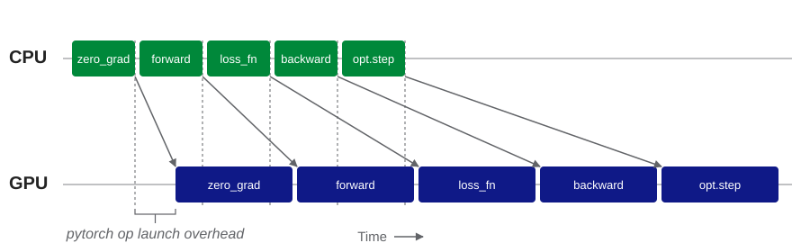
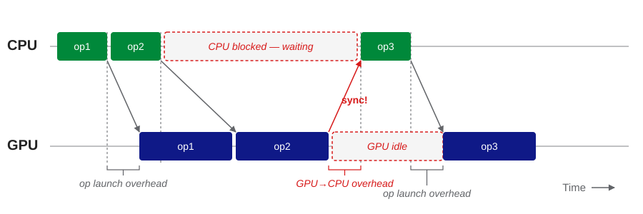

## This Talk

* For everyone writing PyTorch code on GPU: this talk is for you.
* Understand what **CPU-GPU synchronizations** are in PyTorch.
* Why? Syncs are a **silent performance killer**. Your code is still correct, but you are leaving speed on the table.
* Learn how to spot syncs and how to fix them.

## Overview

1. **Basic training loop showing the problem**
2. **Real Profiling: NVIDIA Nsight Systems**
3. **Deep dive into subtle syncs**
4. **Unit testing that code is sync-free**

. . .

## A Familiar Training Loop

``` python
for batch in loader:
    optimizer.zero_grad()
    out = model(batch)
    loss = loss_fn(out, batch.y)
    loss.backward()
    optimizer.step()
    print(f"loss = {loss.item():.4f}")
```

You wrote this on CPU. You tested it. It worked. You moved it to GPU.

. . .

It got faster. Just not as fast as you hoped. `nvidia-smi` shows your GPU at ~50% utilization. You check the batch size, the dataloader, num_workers… everything looks fine.

. . .

Something is quietly wrong with this loop. We'll come back to it.

## The GPU Is Asynchronous

**Principle:** The CPU is the boss of the GPU. 

CPU **schedules** PyTorch ops, which are queued and executed by the GPU.

{width="95%" fig-align="center"}

. . .

The CPU finishes scheduling long before the GPU finishes executing. That's the healthy state: **CPU runs ahead, GPU stays saturated.**

## What Is a CPU-GPU Sync?

A **synchronization** happens when the CPU blocks and waits for data from the GPU. E.g. when a CPU decision depends on that data:

```python
if cuda_tensor >= 0.0:
    # do something
else:
    # do something else
```
. . . 

{width="95%" fig-align="center"}

## Back to the Training Loop

``` {.python code-line-numbers="7"}
for batch in loader:
    optimizer.zero_grad()
    out = model(batch)
    loss = loss_fn(out, batch.y)
    loss.backward()
    optimizer.step()
    print(f"loss = {loss.item():.4f}")
```

`loss.item()` forces the CPU to wait for the GPU. **Every iteration.**

## The Fix

``` {.python code-line-numbers="8-9"}
for batch in loader:
    optimizer.zero_grad()
    out = model(batch)
    loss = loss_fn(out, batch.y)
    loss.backward()
    optimizer.step()

    if i % 100 == 0:
        print(f"loss = {loss.item():.4f}")
```

- `.item()` only once every 100 steps → CPU can run ahead again
- Or: ship losses to a background thread / wandb buffer

# Profiling with NVIDIA Nsight Systems

## Profiling

A simpler PyTorch example:

``` python
n = 5
for _ in range(n):
    out = slow_operation(X)    # e.g. matrix multiplication
    out = quick_operation(out)  # e.g mean()
    if do_print:
        print(out)  # CPU-GPU sync
```

Profiling Command:
``` shell
nsys profile python cpu_gpu_sync_example.py --do-print
```

Full code: <https://gist.github.com/tomasruizt/4281c61bfaead3e61211d052d3971c90>


## Sync-Free (Healthy) {background-image="images/example-code-no-print-annotated.jpg" background-size="contain" background-color="white"}

## With Synchronization {background-image="images/example-code-do-print-annotated.jpg" background-size="contain" background-color="white"}

## Ok, We Stop Writing Slow Code

The PyTorch performance tuning docs^[<https://docs.pytorch.org/tutorials/recipes/recipes/tuning_guide.html#avoid-unnecessary-cpu-gpu-synchronization>] suggest:

* No `cuda_tensor.item()`
* No `print(cuda_tensor)`
* No `cuda_tensor.cpu()`
* No `if cuda_tensor > 1.0:`

# It Goes Deeper... (Deep Dive)

## Dynamic Shapes: The Hidden Trigger

These operations _look_ harmless, but create syncs...

``` {.python code-line-numbers="1-2|4-5|7-9|"}
# both t, mask are GPU tensors
x = t[mask]  # boolean indexing selects subset

# k is an integer on the GPU.
x = t[:k]  # CPU doesn't know len(x)

# size of x depends on contents of t
x = torch.nonzero(t)   # indices of nonzero vals
x = torch.unique(t)    # set of unique vals in t
```

. . .

They sync because PyTorch needs to **allocate the output tensor x**, and it needs the **shape** to do that. If the shape depends on GPU data, the CPU must ask the GPU.

## The Mental Model {.center}

**If the output shape depends on GPU data,
the CPU must ask the GPU → synchronization**

* **Static shape?** → async (healthy)
* **Dynamic shape?** → synchronization

## Fixing Dynamic Shapes

Tell PyTorch the output size up front, so it doesn't have to ask the GPU.

``` python
# ❌ syncs: output_size inferred from `counts` (GPU tensor)
x = torch.repeat_interleave(cuda_tensor, counts)

# ✅ no sync: output_size is a Python int, known to the CPU
x = torch.repeat_interleave(cuda_tensor, counts, output_size=total)
```

. . .

General strategies:

- Use APIs with explicit `output_size=` / `num_classes=` parameters
- Keep shape-defitions like `total` on the **CPU side** when possible
- **Pad to a fixed size** instead of masking variable-length sequences

# Unit Testing

## Testing for Syncs

PyTorch has an experimental debug mode that flags every sync^[<https://docs.pytorch.org/docs/stable/generated/torch.cuda.set_sync_debug_mode.html>]:

``` {.python code-line-numbers="1-5|6-9"}
import torch

torch.cuda.set_sync_debug_mode("warn")    # print a warning
cuda_tensor.item()
# → UserWarning: called a synchronizing CUDA operation

torch.cuda.set_sync_debug_mode("error")   # raise instead
cuda_tensor.item()
# → RuntimeError: called a synchronizing CUDA operation
```

## Testing with Pytest

Use it in **unit tests** to verify that your code is sync-free!

``` {.python code-line-numbers="1-5|1-5,7-8,10,12,14"}
@fail_on_gpu_sync
def test_training_step_has_no_sync():
    inputs = load_inputs()
    out = my_pytorch_fn(inputs)
    assert ...  # correctness check

# Decorator raises RuntimeError if my_pytorch_fn() has any CPU-GPU sync
def fail_on_gpu_sync(fn):
    def wrapper(*args, **kwargs):
        torch.cuda.set_sync_debug_mode("error")
        try:
            return fn(*args, **kwargs)
        finally:
            torch.cuda.set_sync_debug_mode("default")
    return wrapper
```

The function under test (`my_pytorch_fn`) stays **untouched**. The decorator toggles debug mode only in unit tests.

## Takeaways

1. **Async is the default**: CPU runs ahead, GPU stays busy.
2. **A sync is any op that blocks the CPU for a GPU value.**
3. **Obvious triggers:** `.item()`, `print()`, `.cpu()`, `if-else` branching...
4. **Subtle triggers:** dynamic output shapes (`mask`, `nonzero`, `repeat_interleave` w/o `output_size`).
5. **Fix:** pass explicit sizes, pad to fixed shapes, sync less often.
6. **Test it:** `set_sync_debug_mode("error")` in your unit tests.

# Thank You!

Blog Post: <https://tomasruizt.github.io/posts/08_cpu_gpu_synchronization>

## Appendix - Intentional Sync

Common use case to measure execution time:

```python
start_event = torch.cuda.Event(enable_timing=True)
end_event = torch.cuda.Event(enable_timing=True)

start_event.record()
fn()
end_event.record()

torch.cuda.synchronize()  # wait for fn() to finish
```

## Appendix - Triton Kernels

* Triton is a programming language (Python library) to author GPU kernels^[<https://triton-lang.org/main/getting-started/tutorials/>].
* Model input data preparation can require 10 different PyTorch ops (`torch.zeros()`, `torch.arange()`, `torch.gather() / scatter()`, etc.). We ays the **op launch overhead price** 10 times 🐌. You can replace all this with a single Triton kernel.
* PyTorch might not have the static shape API you need to avoid syncrhonization (see passing `torch.repeat_interleave(..., output_size=20)`). In this case, you can write your own Triton kernel.
