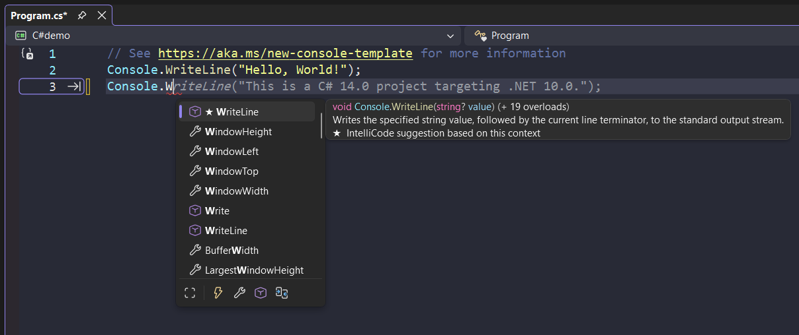
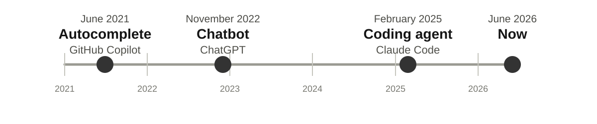

# Agenda

* Coding Agents Explained
* Hands-On Paper Replication

# 2021: Code Autocompletion

AI suggests the next code while you type. One can accept, ignore, or edit the suggestion. Github (Microsoft) released Copilot on June 29, 2021.

{width=82%}

# AI Timeline

{width=100%}

# What is a Coding Agent?

It is AI that takes actions on your behalf (agent).
We focus on the local coding agents (on your laptop).

* It can run commands and scripts
* It can read and write local files (code, papers, presentations, etc.)
* It can search the web, download datasets, etc.

Its like ChatGPT, but witout having to copy-paste back and forth.

# Coding Agent Example

<video controls preload="metadata" width="100%">
  <source src="videos/agentic-example-transpose-table.mp4" type="video/mp4">
</video>

## Largest Providers

| Company | {width=150px} | {width=150px} |
|---|---|---|
| Website | <https://chatgpt.com> | <https://claude.ai> |
| Chatbot | ChatGPT | Claude |
| ^ release date | Nov 30, 2022 | Mar 14, 2023 |
| Coding agent | Codex | Claude Code |
| ^ release date | Apr 16, 2025 | Feb 24, 2025 |

Coding agent is included in your 20€/month subscription. Pick whatever you like.

# Hands-On

Replication of AJR (2001), "The Colonial Origins of Comparative Development".

* Download dataset
* Plot figures
* Run regressions, create tables
* Compare to original results
* Write a report