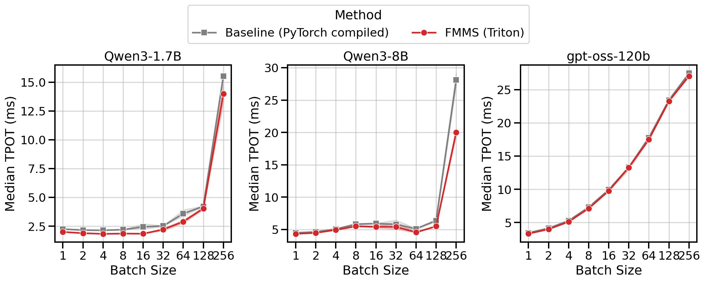
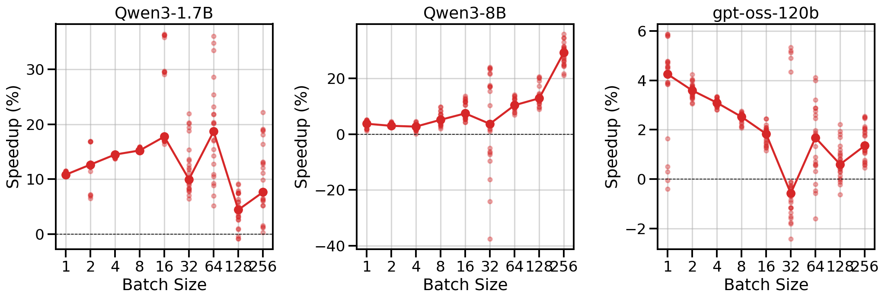

<!-- TODO (sorted easiest to hardest)
- In the relative perf comparison plot against FlashInfer, use this order: FMMS, FlashInfer:sampling_from_logits, FlashInfer:top_k_top_p.
- Add discussion on the vLLM speedup plot's large per-run variability (the scattered dots), especially at higher concurrency levels.
- Add a TL;DR section at the top with the main performance statements and a brief motivation for why this kernel is interesting.
- Explain why Qwen3-8B FMMS is faster at larger batch sizes despite being slower in kernel microbenchmarks at those sizes.
- A side-by-side diagram comparing FMMS to the PyTorch baseline (fused single-pass vs unfused matmul-write-read-sample pipeline).
- Make tabsets have less padding.
- Boldface (or color-code) the most important cells in each table.
- Make plots accessible for color-blind readers, but minimize changes.
-->

## The Bottleneck

Every LLM decode step runs the same pipeline: multiply hidden states by the LM head weights to produce logits, normalize via softmax, then sample a token.
The logits tensor has shape $[N, V]$, where $V$ is the vocabulary size (up to 256K) and $N$ is the batch size.
In the standard approach, this entire tensor is written to HBM and then read back for sampling.
This round-trip is pure waste when the operation is memory-bound, which is the common case during decode ($N \leq 64$).

```python
def sample(
    weights: torch.Tensor,       # [V, d]
    hidden_states: torch.Tensor, # [N, d]
):
    logits = hidden_states @ weights.T  # [N, V]
    probs = logits.softmax(dim=-1)      # [N, V]
    samples = torch.multinomial(probs, num_samples=1)
    return samples  # [N, 1]
```

Existing libraries assume the logits are already materialized: FlashInfer's [@ye2025flashinfer] sampling kernels take `logits` or `probs` as input, and Liger Kernel [@hsu2025ligerkernelefficienttriton] targets training rather than inference.
Can the matmul and sampling be fused into a single kernel that never writes logits to HBM?

## The Idea: Fuse Everything

FMMS (Fused Matrix Multiplication & Sampling) computes the matmul and samples in one kernel, never writing logits to HBM.
The trick is the Gumbel-max reparameterization, which replaces softmax + multinomial with a single argmax over noised logits:

$$
\text{sample} = \text{argmax}_i \left( \ell_i + G_i \right) \sim \text{Categorical}(\pi)
$$

where $G_i \sim \text{Gumbel}(0, 1)$ are i.i.d. noise variables and $\ell_i$ are the logits.
The crucial property is that argmax decomposes over tiles: each tile of the vocabulary computes its local maximum, and a cheap global reduction over tile-local maxima produces the final sample.
The kernel computes logits tile by tile, finds each tile's winner, and discards the rest.

The rest of this post shows the benchmark results first, then explains the algorithm in detail.

## Kernel Benchmarks

The LM head is a dense `[V, d]` matrix in every model, including MoE architectures (MoE only replaces the FFN layers, not the LM head).
MoE models have surprisingly small hidden dimensions relative to their parameter count because the extra parameters live in expert FFN layers, not the LM head.
I benchmark two workload sizes based on [this analysis](https://github.com/tomasruizt/fused-mm-sample/blob/main/findings/lm-head-configurations.md) of LM head configurations across 25+ models:

- **Small** (V=151,936, d=4,096): Qwen3-8B, and notably Qwen3-235B MoE (which has d=4,096 despite 235B total parameters).
- **Large** (V=128,256, d=8,192): Llama 3 70B, DeepSeek V3 (d=7,168).

### Baselines

Both FlashInfer kernels require the full logits, so I include in their runtime the matmul to compute the logits. This is a fair comparison because FMMS also computes a matmul -- the logits are just never written to VRAM.

(1) **Naive PyTorch Compiled**: torch compiled matmul + softmax + `torch.multinomial`.
(2) **FlashInfer `top_k_top_p_sampling_from_logits`**: A dual-pivot rejection sampling kernel used in vLLM for top-k/top-p sampling.
(3) **FlashInfer `sampling_from_logits`**: FlashInfer's fastest sampling kernel. It also uses the Gumbel-max trick internally, but operates on pre-materialized logits.

All baselines are torch compiled, so the matmul dispatches to cuBLAS.

### GPUs

Since FMMS saves memory bandwidth, its advantage depends on how memory-bound the workload is.
I benchmark across four modern datacenter GPUs:

| GPU | HBM Bandwidth (GB/s) | Peak BF16 (TFLOP/s) | Ops:Byte Ratio |
| --- | --- | --- | --- |
| B300 | 8,000 | 2,250 | 281 |
| B200 | 8,000 | 2,250 | 281 |
| H200 | 4,800 | 989 | 206 |
| H100 | 3,350 | 989 | 295 |

: {.sm}

The ops:byte ratio (peak compute / peak bandwidth) determines the crossover point where the matmul transitions from memory-bound to compute-bound.

### Scaling Behavior

@fig-batch-scaling shows execution time (left) and throughput in samples/ms (right) across batch sizes.
All methods have nearly flat latency from N=1 to 32 (memory-bound: runtime is dominated by loading the weight matrix).
Beyond N=64, latency rises as the matmul becomes compute-bound.
FMMS (red) is the fastest method in the flat region, where fusion eliminates the extra HBM round-trip for logits.
At larger batch sizes, the baselines catch up as the matmul approaches the compute-bound regime and cuBLAS efficiency matters more.

::::: {.panel-tabset group="workload-size"}
# Small

::: {.panel-tabset group="gpu"}
## B300
{width="100%" #fig-batch-scaling}

## B200
{width="100%"}

## H200
{width="100%"}

## H100
{width="100%"}
:::

# Large

::: {.panel-tabset group="gpu"}
## B300
{width="100%"}

## B200
{width="100%"}

## H200
{width="100%"}

## H100
{width="100%"}
:::

:::::

*All benchmarks: PyTorch 2.10.0, CUDA 13.0, run on Modal. Data as of 2026-02-11.*

### Relative Performance Across GPUs

The relative speedup tables show `baseline_time / fmms_time`, so values > 1.0 mean FMMS is faster.

::::: {.panel-tabset group="baseline"}
# PyTorch Compiled

This is the sampling path used in vLLM when top-k and top-p are unset (torch compiled matmul + softmax + `torch.multinomial`).

:::: {.panel-tabset group="workload-size"}
### Small

::: {.panel-tabset group="gpu"}
#### B300
{width="80%" #fig-relative-perf-vs-pytorch}

#### B200
{width="80%"}

#### H200
{width="80%"}

#### H100
{width="80%"}
:::

<details>
<summary>Show data table</summary>

| GPU / Batch Size | 1 | 2 | 4 | 8 | 16 | 32 | 64 | 128 | 256 |
| --- | - | - | - | - | - | - | - | - | - |
| B300 | 1.40 | 1.38 | 1.39 | 1.35 | 1.43 | 1.38 | 1.38 | 1.48 | 1.33 |
| B200 | 1.36 | 1.38 | 1.37 | 1.41 | 1.41 | 1.39 | 1.36 | 1.48 | 1.31 |
| H200 | 1.24 | 1.25 | 1.22 | 1.25 | 1.28 | 1.30 | 1.33 | 1.26 | 1.06 |
| H100 | 1.22 | 1.23 | 1.21 | 1.22 | 1.25 | 1.29 | 1.40 | 1.52 | 1.23 |

: Speedup vs PyTorch Compiled (small config) {.sm .striped}

</details>

### Large

::: {.panel-tabset group="gpu"}
#### B300
{width="80%"}

#### B200
{width="80%"}

#### H200
{width="80%"}

#### H100
{width="80%"}
:::

<details>
<summary>Show data table</summary>

| GPU / Batch Size | 1 | 2 | 4 | 8 | 16 | 32 | 64 | 128 | 256 |
| --- | - | - | - | - | - | - | - | - | - |
| B300 | 1.34 | 1.33 | 1.23 | 1.26 | 1.28 | 1.29 | 1.23 | 0.96 | 0.71 |
| B200 | 1.35 | 1.31 | 1.27 | 1.24 | 1.26 | 1.25 | 1.27 | 0.97 | 0.74 |
| H200 | 1.26 | 1.23 | 1.22 | 1.22 | 1.22 | 1.23 | 1.28 | 0.93 | 0.78 |
| H100 | 1.22 | 1.22 | 1.20 | 1.21 | 1.21 | 1.21 | 1.28 | 1.13 | 0.87 |

: Speedup vs PyTorch Compiled (large config) {.sm .striped}

</details>

::::

For the small config, FMMS is faster at **all batch sizes on all GPUs** (minimum 1.06x on H200 at N=256), with speedups of 6-52%.
The larger vocab (V=151,936) means more logits traffic, making fusion valuable even at high batch sizes.
For the large config, FMMS wins at batch sizes 1-64 (20-35% faster) but regresses at N=128+ on B300/B200/H200.
H100 retains its advantage at larger batch sizes than other GPUs: at N=128, it still achieves 1.13x (large) and 1.52x (small).
This is likely because H100 has the highest ops:byte ratio (295), keeping the matmul memory-bound longer.

# FlashInfer

Two FlashInfer baselines are compared:

* `flashinfer:sampling_from_logits()` is FlashInfer's fastest sampling kernel, but not used in vLLM. It also uses the Gumbel-max trick internally, but operates on pre-materialized logits.
* `flashinfer:top_k_top_p_sampling_from_logits()` is the sampling function used in vLLM when top-k or top-p is set (I set top-k=-1 and top-p=1.0 to disable filtering).

:::: {.panel-tabset group="workload-size"}
### Small

::: {.panel-tabset group="gpu"}
#### B300
{width="80%" #fig-relative-perf-vs-flashinfer}

#### B200
{width="80%"}

#### H200
{width="80%"}

#### H100
{width="80%"}
:::

<details>
<summary>Show data table: vs <code>top_k_top_p</code></summary>

| GPU / Batch Size | 1 | 2 | 4 | 8 | 16 | 32 | 64 | 128 | 256 |
| --- | - | - | - | - | - | - | - | - | - |
| B300 | 2.05 | 2.05 | 1.94 | 2.24 | 2.30 | 2.10 | 1.89 | 1.72 | 1.63 |
| B200 | 1.36 | 1.46 | 1.48 | 1.47 | 1.48 | 1.36 | 1.23 | 1.17 | 1.06 |
| H200 | 1.29 | 1.37 | 1.35 | 1.37 | 1.36 | 1.32 | 1.23 | 1.04 | 0.89 |
| H100 | 1.30 | 1.25 | 1.30 | 1.30 | 1.29 | 1.27 | 1.29 | 1.25 | 1.00 |

: Speedup vs `top_k_top_p` (small config) {.sm .striped}

</details>

<details>
<summary>Show data table: vs <code>sampling_from_logits</code></summary>

| GPU / Batch Size | 1 | 2 | 4 | 8 | 16 | 32 | 64 | 128 | 256 |
| --- | - | - | - | - | - | - | - | - | - |
| B300 | 1.25 | 1.23 | 1.24 | 1.23 | 1.23 | 1.14 | 1.04 | 1.00 | 0.89 |
| B200 | 1.25 | 1.24 | 1.24 | 1.22 | 1.22 | 1.14 | 1.03 | 0.96 | 0.85 |
| H200 | 1.16 | 1.17 | 1.14 | 1.14 | 1.13 | 1.08 | 1.01 | 0.84 | 0.70 |
| H100 | 1.15 | 1.15 | 1.13 | 1.13 | 1.13 | 1.11 | 1.10 | 1.03 | 0.77 |

: Speedup vs `sampling_from_logits` (small config) {.sm .striped}

</details>

### Large

::: {.panel-tabset group="gpu"}
#### B300
{width="80%"}

#### B200
{width="80%"}

#### H200
{width="80%"}

#### H100
{width="80%"}
:::

<details>
<summary>Show data table: vs <code>top_k_top_p</code></summary>

| GPU / Batch Size | 1 | 2 | 4 | 8 | 16 | 32 | 64 | 128 | 256 |
| --- | - | - | - | - | - | - | - | - | - |
| B300 | 1.57 | 1.65 | 1.66 | 1.67 | 1.67 | 1.64 | 1.55 | 1.09 | 0.89 |
| B200 | 1.27 | 1.24 | 1.21 | 1.19 | 1.21 | 1.20 | 1.18 | 0.86 | 0.68 |
| H200 | 1.25 | 1.21 | 1.22 | 1.22 | 1.22 | 1.20 | 1.20 | 0.81 | 0.75 |
| H100 | 1.18 | 1.22 | 1.19 | 1.20 | 1.20 | 1.18 | 1.20 | 1.01 | 0.79 |

: Speedup vs `top_k_top_p` (large config) {.sm .striped}

</details>

<details>
<summary>Show data table: vs <code>sampling_from_logits</code></summary>

| GPU / Batch Size | 1 | 2 | 4 | 8 | 16 | 32 | 64 | 128 | 256 |
| --- | - | - | - | - | - | - | - | - | - |
| B300 | 1.14 | 1.14 | 1.08 | 1.08 | 1.08 | 1.07 | 1.03 | 0.76 | 0.57 |
| B200 | 1.15 | 1.15 | 1.07 | 1.07 | 1.07 | 1.06 | 1.06 | 0.77 | 0.57 |
| H200 | 1.13 | 1.12 | 1.11 | 1.10 | 1.10 | 1.09 | 1.08 | 0.72 | 0.63 |
| H100 | 1.13 | 1.13 | 1.12 | 1.12 | 1.11 | 1.10 | 1.11 | 0.90 | 0.67 |

: Speedup vs `sampling_from_logits` (large config) {.sm .striped}

</details>

::::

Vs `top_k_top_p`, FMMS is up to **2.30x faster** (B300, small config, N=16).
For the small config on B300, FMMS is 1.63-2.30x faster across all batch sizes.
B300 is a striking outlier: 1.6-2.3x speedups while B200/H200/H100 show 1.2-1.5x.
B200 and B300 have identical bandwidth and compute specs, and FMMS runs at the same speed on both (within 2%).
The gap is entirely because FlashInfer's `top_k_top_p` is ~35% slower on B300 than on B200, likely due to incomplete optimization for the newer B300 architecture (sm_110).

Vs `sampling_from_logits`, **FMMS is faster at all batch sizes from 1 to 64 on every GPU tested**, with speedups of 3-25%.
For the small config, FMMS stays above 1.0x up to N=128 on B300/H100.
For the large config, it regresses at N=128+ on most GPUs.
:::::

## Roofline Analysis

The benchmarks above show a clear crossover: FMMS wins at small batch sizes and regresses at large ones.
The explanation lies in the **arithmetic intensity** of the matmul. The matmul $W_{[V, d]} \times H_{[N, d]}^T$ has:

$$
\text{Arithmetic Intensity} = \frac{\text{FLOPs}}{\text{Bytes}} = \frac{2 \cdot V \cdot d \cdot N}{2 \cdot V \cdot d} = N
$$

The weight matrix $W$ dominates the memory traffic ($V \cdot d$ elements, each read once), and the hidden states are negligible when $N \ll V$[^hidden-states-negligible]. So the arithmetic intensity is simply $N$: each byte of weights loaded produces $N$ multiply-adds.

[^hidden-states-negligible]: Even at the largest benchmarked batch size (N=256) with the small config (V=151,936, d=4,096), the hidden states are 256 $\times$ 4,096 $\times$ 2 bytes = 2 MB versus 1.17 GB for the weight matrix (0.17%). The exact arithmetic intensity is $N \cdot V / (V + N)$ = 255.57, versus the approximation of 256.

A GPU becomes compute-bound when the arithmetic intensity exceeds its **ops:byte ratio** (peak compute / peak memory bandwidth). For the H100:

$$
\text{ops:byte} = \frac{989 \text{ TFLOP/s (BF16)}}{3.35 \text{ TB/s (HBM3)}} \approx 295
$$

The roofline plot in @fig-roofline confirms this: all methods track the memory-bound slope up to N=64, then flatten as they approach the compute ceiling.
Each point is labeled with its batch size.
FMMS sits slightly above the baselines in the memory-bound region, reflecting its bandwidth savings from avoiding the logits round-trip.

::::: {.panel-tabset group="workload-size"}
### Small
::: {.panel-tabset group="gpu"}
# B300
{width="85%" #fig-roofline}

# B200
{width="85%"}

# H200
{width="85%"}

# H100
{width="85%"}
:::
### Large
::: {.panel-tabset group="gpu"}
# B300
{width="85%"}

# B200
{width="85%"}

# H200
{width="85%"}

# H100
{width="85%"}
:::
::::

### Memory Throughput

@fig-memory-throughput shows the achieved memory throughput (GB/s) as a function of batch size.
At low batch sizes (N $\leq$ 64), where the operation is deeply memory-bound, FMMS consistently achieves higher throughput than all baselines.
Peak SoL varies by GPU and config: up to ~90% on H100/H200 (large config), ~55-60% on B300/B200 (small config).
100% would mean the kernel does nothing but stream the weight matrix from HBM at the hardware's maximum rate, with zero overhead for computation, synchronization, or memory access patterns.
This is the direct mechanism behind the speedups: by fusing the matmul and sampling, FMMS uses the available memory bandwidth more efficiently.

::::: {.panel-tabset group="workload-size"}
### Small
::: {.panel-tabset group="gpu"}
# B300
{width="85%" #fig-memory-throughput}

# B200
{width="85%"}

# H200
{width="85%"}

# H100
{width="85%"}
:::
### Large
::: {.panel-tabset group="gpu"}
# B300
{width="85%"}

# B200
{width="85%"}

# H200
{width="85%"}

# H100
{width="85%"}
:::
::::

### Takeaway

| $N$ | Regime on H100 (ridge = 295) |
| - | - |
| 1 | Memory-bound (295x below ridge) |
| 32 | Memory-bound (9x below) |
| 64 | Memory-bound (5x below) |
| 295 | Crossover to compute-bound |

: {.sm}

**When memory-bound**, the kernel's throughput is determined by how fast it reads the weight matrix from HBM. FMMS wins here because it reads the weights **once** and performs both the matmul and sampling in-kernel. The unfused baselines read the weights for the matmul, write logits to HBM, then read them back for sampling. This extra round-trip wastes bandwidth on the bottleneck path.

**When compute-bound**, the matmul dominates runtime and the cost of the extra HBM traffic for logits becomes negligible relative to the computation. 
The baselines can use highly optimized matmul implementations (cuBLAS via `torch.compile`), while FMMS implements the matmul in Triton.
It also suffers from higher register pressure, because it fuses Gumbel noise generation and the max-reduction into the same kernel.

The theoretical crossover is the GPU's ops:byte ratio (the ridge point in @fig-roofline): 295 for H100, 281 for B300/B200, 206 for H200.
In practice, the transition is gradual: @fig-memory-throughput shows that achieved throughput already drops at N=128, well before the ridge point.
This is why FMMS loses its advantage at large batch sizes despite still being "memory-bound" in roofline terms.
The sweet spot for FMMS is the typical LLM decode regime (N $\leq$ 64), where the operation is deeply memory-bound and fusion pays off the most.

## End-to-End: vLLM

The kernel benchmarks measure the FMMS kernel in isolation.
To measure end-to-end impact, I integrated FMMS into vLLM ([branch](https://github.com/tomasruizt/vllm/tree/feature/fmms-sampler)) and benchmarked median time per output token (TPOT) across concurrency levels using `vllm bench sweep`.
I chose three models spanning different sizes and architectures.
The LM head is a standard dense linear layer in all three, so FMMS applies identically regardless of MoE routing.

| Model | Type | Hidden size (d) | Vocab size (V) |
| - | --- | - | - |
| Qwen3-1.7B | Dense | 2,048 | 151,936 |
| Qwen3-8B | Dense | 4,096 | 152,064 |
| gpt-oss-120b | MoE (128 experts, 4 active) | 2,880 | 201,088 |

: {.sm}

Each configuration is run 5 times; the table shows the median TPOT (lower is better) and the TPOT reduction.
All results are on a B200 GPU with PyTorch 2.10.0 and CUDA 13.0, run on Modal.

{width="100%" #fig-tpot-vs-concurrency}

{width="100%" #fig-speedup-vs-concurrency}

<details>
<summary>Show per-model data tables</summary>

::: {.panel-tabset group="model"}
# Qwen3-1.7B

Qwen3-1.7B has V=151,936 and d=2,048.
The small hidden dimension makes the LM head matmul strongly memory-bound, so fusion has a large impact.

| Concurrency | Baseline (ms) | FMMS Triton (ms) | TPOT Reduction |
| - | - | - | - |
| 1 | 2.25 | 2.00 | -10.8% |
| 2 | 2.14 | 1.87 | -12.6% |
| 4 | 2.15 | 1.84 | -14.5% |
| 8 | 2.19 | 1.86 | -15.2% |
| 16 | 2.24 | 1.85 | -17.7% |
| 32 | 2.52 | 2.28 | -10.0% |
| 64 | 3.47 | 2.82 | -18.7% |
| 128 | 4.21 | 4.05 | -4.4% |
| 256 | 15.43 | 14.28 | -7.6% |

: {.sm .striped}

FMMS reduces TPOT by 10-19% across all concurrency levels.
Peak improvement is -18.7% at concurrency 64.

# Qwen3-8B

Qwen3-8B has V=152,064 and d=4,096.
The larger hidden dimension means the LM head matmul is a bigger fraction of the decode step compared to Qwen3-1.7B, but still strongly memory-bound.

| Concurrency | Baseline (ms) | FMMS Triton (ms) | TPOT Reduction |
| - | - | - | - |
| 1 | 4.50 | 4.34 | -3.7% |
| 2 | 4.63 | 4.49 | -3.0% |
| 4 | 5.07 | 4.93 | -2.7% |
| 8 | 5.79 | 5.53 | -5.1% |
| 16 | 5.93 | 5.52 | -7.4% |
| 32 | 6.06 | 5.14 | -3.7% |
| 64 | 5.06 | 4.53 | -10.3% |
| 128 | 6.27 | 5.47 | -12.8% |
| 256 | 27.73 | 19.61 | -29.3% |

: {.sm .striped}

FMMS reduces TPOT by 3-29%.
Peak improvement is -29.3% at concurrency 256.

# gpt-oss-120b

gpt-oss-120b has V=201,088 and d=2,880.
The improvement is smaller because the LM head matmul is a smaller fraction of the total decode step in a 120B-parameter model.

| Concurrency | Baseline (ms) | FMMS Triton (ms) | TPOT Reduction |
| - | - | - | - |
| 1 | 3.45 | 3.29 | -4.3% |
| 2 | 4.14 | 3.99 | -3.6% |
| 4 | 5.28 | 5.11 | -3.1% |
| 8 | 7.30 | 7.12 | -2.5% |
| 16 | 9.94 | 9.77 | -1.8% |
| 32 | 13.34 | 13.39 | +0.6% |
| 64 | 17.80 | 17.50 | -1.7% |
| 128 | 23.39 | 23.25 | -0.6% |
| 256 | 27.43 | 27.06 | -1.4% |

: {.sm .striped}

FMMS reduces TPOT by 2-4% at low concurrency (1-8).
:::

</details>

## Correctness

FMMS uses the Gumbel-max trick, which produces **exact** samples from the categorical distribution, not an approximation.
But because the output is stochastic, correctness is harder to verify than for a deterministic kernel.
You cannot compare the output to a reference value; instead, you need statistical tests that verify the output *distribution* is correct.

I verify this with a chi-squared goodness-of-fit test that runs as a regular unit test during development: draw 10,000 samples from the kernel using synthetic inputs with known logit vectors, and compare the empirical token frequencies against the theoretical softmax probabilities.
The test is parametrized over multiple vocabulary sizes and batch sizes to catch tile-boundary edge cases.

### End-to-End: GSM8K

As an end-to-end quality check, I integrated FMMS into vLLM and ran the GSM8K benchmark (1,319 questions, 0-shot chain-of-thought) via [lm-evaluation-harness](https://github.com/EleutherAI/lm-evaluation-harness) on Qwen3-1.7B.
Answers were graded by an LLM judge.

| Variant | Accuracy | 95% CI |
| --- | - | - |
| Baseline (vLLM default) | 89.6% | [87.9%, 91.2%] |
| FMMS Triton | 89.4% | [87.7%, 91.0%] |

: GSM8K accuracy on Qwen3-1.7B {.sm}

To test whether this 0.2 percentage point difference is meaningful, I use a paired bootstrap test (10,000 resamples).
The test is *paired* because both variants answer the same 1,319 questions: it computes per-question differences (correct vs. incorrect), then bootstraps the mean difference.
This cancels out shared question difficulty and focuses on questions where the variants actually disagree.
The result is p=0.776, far from significant (threshold: p < 0.05), confirming that FMMS does not degrade model accuracy.

## The Algorithm

The previous sections showed what FMMS achieves; this section explains how it works.
The inputs are the LM head weights $W$ with shape $(V, d)$ and hidden states $H$ with shape $(N, d)$.
Inside the kernel, $H$ is transposed to $(d, N)$ so the matmul $W \times H^T$ produces logits of shape $(V, N)$.

### Tiled Matmul

To break down the computation into an incremental fashion, I used Triton, which supports tiling the computation.
The logits are the result of a matrix multiplication, which can be tiled across the $V$, $d$, and $N$ dimensions as shown in @fig-tiled-mm.
The tiles of $W$ have shape $(T_V, T_d)$ while the tiles of $H$ have shape $(T_d, T_N)$.
The resulting tiles of the logits have shape $(T_V, T_N)$.

{width="80%" text-align="left" fig-alt="Tiling the computation of the logits" .lightbox #fig-tiled-mm}

### Why Tiled Sampling Is Hard

The next part of the puzzle is how to incrementally sample based on a single tile of logits, rather than on the full vector of logits.
The problem is not strictly the softmax normalization factor, which can be computed incrementally (online-softmax).
Rather, the problem is that the relative likelihood of each token is unknown until the last (bottom) tile of logits is computed.

To understand this, consider the logits case below, where the vocabulary size $V=8$, the tile size $T_V=2$ (so, 8/2 = 4 tiles).
The horizontal lines separate the tiles.
Notice how it is impossible to know and sample from the highest probability logit (50.0) until the last tile is computed.

$$
\begin{aligned}
L &= \begin{bmatrix}
1.0 \\
1.2 \\
\hline
2.0 \\
1.4 \\
\hline
1.0 \\
2.1 \\
\hline
1.1 \\
50.0
\end{bmatrix}
\end{aligned}
$$

However, there is one statistical trick to circumvent this problem: The Gumbel-Max trick.

### The Gumbel-Max Trick

The Gumbel-max trick enables sampling from a categorical distribution using only logits, completely bypassing the softmax function. The key identity is:

$$
\text{argmax}_i \left( \log \pi_i + G_i \right) \sim \text{Categorical}(\pi_1, \ldots, \pi_V)
$$

where $G_i \sim \text{Gumbel}(0, 1)$ are i.i.d. Gumbel random variables, and $\pi_i$ are the (unnormalized) probabilities.
Since logits are $\ell_i = \log \pi_i$ (up to a constant that cancels in the argmax), this is equivalently:

$$
\text{sample} = \text{argmax}_i \left( \ell_i + G_i \right)
$$

A Gumbel(0,1) random variable can be generated from a uniform random variable $U \sim \text{Uniform}(0, 1)$ as $G = -\log(-\log(U))$.

#### Why this is useful for tiled computation

The crucial property is that **argmax decomposes over tiles**. If the vocabulary is split into tiles $T_1, T_2, \ldots, T_K$, the local maximum in each tile can be computed independently:

$$
m_k = \max_{i \in T_k} \left( \ell_i + G_i \right), \quad a_k = \text{argmax}_{i \in T_k} \left( \ell_i + G_i \right)
$$

and then the global sample is simply:

$$
\text{sample} = a_{k^*} \quad \text{where} \quad k^* = \text{argmax}_k \, m_k
$$

Each tile only needs to output two values: its local max $m_k$ and the corresponding vocabulary index $a_k$. The full logit vector is never materialized -- each tile computes its logits, adds Gumbel noise, finds the local winner, and discards the rest. The final reduction over $K$ tiles is trivially cheap.

Compare this with the standard approach: softmax requires a full pass to compute the normalizer $Z = \sum_i e^{\ell_i}$, then another pass to compute probabilities, then sampling via inverse CDF. None of these operations decompose over tiles without cross-tile communication.

### Two-Stage Architecture

Putting the tiled matmul and the Gumbel-max trick together, the kernel has a two-stage design:

**Stage 1 (GPU kernel):** The Triton kernel launches a 2D grid of programs indexed by `(v, h)`, where `v` ranges over vocabulary tiles and `h` over batch tiles. Each program:

1. Computes its tile of logits via the tiled matmul: `logits_blk = W_tile @ H_tile.T`
2. Scales by temperature: `logits_blk /= temperature`
3. Generates Gumbel noise and adds it to the logits
4. Finds the local maximum and argmax over the vocabulary dimension
5. Writes the local max value and the corresponding global vocabulary index to main memory

Each program outputs just two values per hidden state: the local max and its index. The intermediate output is a tensor of shape `[num_V_tiles, N, num_samples]`.

**Stage 2 (host-side reduction):** A simple PyTorch reduction finds which tile had the global maximum for each hidden state, then gathers the corresponding vocabulary index:

```python
best_tiles = tile_maxs.argmax(dim=0)   # which tile won?
samples = tile_indices.gather(0, best_tiles)  # what index did it have?
```

This stage operates on `num_V_tiles` elements per hidden state (e.g. 512 tiles for V=128K with a tile size of 256) and is negligibly cheap compared to stage 1.

## Lessons from the Trenches

### Profiling with Nsight Compute

NVIDIA Nsight Compute (NCU) was invaluable for identifying optimization opportunities. The profiler provides detailed metrics on warp stalls, memory utilization, and cache behavior. Here are the key insights it surfaced:

**Warp stalls and memory access patterns.** The initial version showed significant warp stalls due to suboptimal memory access. NCU suggested looking for opportunities to improve memory access patterns, which led me to transpose the hidden states for coalesced reads. However, this change had only a marginal effect.

**Increasing tile size for data reuse.** A much better improvement was to increase the tile size along the batch dimension ($T_N$) from 4 to 32. This means each tile of weights is reused 8x more often to compute logits, directly improving the arithmetic intensity. This is a classic compute-vs-memory optimization: at small batch sizes the kernel is memory-bound, so making each weight load do more useful work is the primary lever.

**Shared memory bank conflicts.** The profiler also flagged bank conflicts when storing data to shared memory. In CUDA, this is relatively easy to fix by padding the shared memory array by +1 element per row, breaking the stride alignment. In Triton, there is no direct control over shared memory layout, so I left this optimization on the table.

### Swizzling Bug

The Triton documentation for matrix multiplication suggests to swizzle the program ids to improve the data reuse. @fig-loading-blocks-in-grouped-order shows the difference between loading data blocks in row-major order vs loading them in a "grouped" order.
The expected benefit of this optimization is a "more than 10%" speedup in the matmul performance.
The reason is that tiles of data are not loaded from VRAM but rather from the faster L2 cache.

](imgs/grouped_vs_row_major_ordering.png){width="80%" text-align="left" fig-alt="Loading Blocks in Grouped Order" .lightbox #fig-loading-blocks-in-grouped-order}

I implemented this optimization with the existing Triton function `triton.language.swizzle_2d` ([docs](https://triton-lang.org/main/python-api/generated/triton.language.swizzle2d.html)), and saw speed increase massively. The Nsight Compute profiler showed that the L2 cache utilization increased from 50% to 90%, a steep jump.

However, I had made a mistake and passed wrong arguments to `swizzle_2d`.
This resulted in the same tiles being reloaded again and again, destroying the correctness of the computation, and explaning the excessive L2 cache utilization.
This bug was nevertheless difficult to catch, because the output of the kernel is a stochastic sample, rather than a deterministic result.
What made me suspicious was that my kernel, which includes a matmul, was 2x faster than the cuBLAS matmul, which should be close to optimal.
The performance was _too good to be true_, so I dug deeper and found the bug.

::: {.callout-note}
If you don't understand why your algorithm is running faster than expected, something might be wrong with the code.
:::

### `torch.multinomial` and bfloat16

`torch.multinomial` (used in the naive baseline) produces incorrect sampling distributions when given bfloat16 probabilities.
The internal CDF accumulation loses precision with bfloat16's 7-bit mantissa.
The fix is to upcast to float32 before softmax: `probs = (logits.float() / temperature).softmax(dim=-1)`.
This is a real bug that affects production code, and PyTorch's documentation does not mention this precision requirement.

### Makefiles for GPU Benchmarking

This project uses Makefiles to orchestrate benchmarking across cloud GPUs and local profiling.
What started as a few convenience targets grew into the primary interface for running experiments.
The root Makefile defines a three-stage pipeline for kernel benchmarks: (1) run on Modal, (2) download results, (3) generate plots.
The commands can be parametrized, as exemplified below:

```makefile
make modal-triton-benchmark GPU=h100!   # full pipeline on H100
make modal-triton-benchmark GPU=b200    # same pipeline on B200
make modal-triton-benchmark-all-gpus    # loop over all GPUs
```

Makefiles can use `$(shell which python)` instead of hardcoded paths, so the same targets work across local dev machines and remote cloud GPUs.

## Related Work

_Cut Your Losses in Large-Vocabulary Language Models_ [@wijmans2025cut] is the direct inspiration for this work.
They avoid materializing logits during training by computing the cross-entropy loss incrementally on SRAM, reducing memory from 24GB to 1MB for Gemma 2 (2B).
FMMS extends this idea to inference, where the challenge shifts from loss computation to sampling.

_FlashSampling_ [@qin2025flashsampling] presents a conceptually similar algorithm for fused sampling.
The paper was submitted to ICLR 25 but rejected due to weak justification and experimental evidence.
This post presents comprehensive benchmarks against strong baselines across multiple GPUs.

_FlashInfer_ [@ye2025flashinfer] provides high-performance sampling kernels used in vLLM [@DBLP:conf/sosp/KwonLZ0ZY0ZS23] and SGLang [@zheng2024sglang], but all its sampling functions take pre-materialized logits or probabilities as input.
_Liger Kernel_ [@hsu2025ligerkernelefficienttriton] focuses on training-time kernel fusion and includes no sampling primitives.
The _online-softmax_ method [@milakov2018onlinenormalizercalculationsoftmax] enables incremental normalization and is used in _FlashAttention_ [@dao2022flashattention], but neither applies it to sampling from the LM head.

## Conclusion

FMMS demonstrates that fusing matrix multiplication with sampling via the Gumbel-max trick is both correct and practical.
In kernel microbenchmarks, FMMS outperforms every baseline on every GPU tested at batch sizes 1 to 64: 2-15% faster than the fastest baseline (FlashInfer `sampling_from_logits`) and 19-37% faster than PyTorch compiled sampling.
These are the batch sizes that matter most for LLM decode, where the operation is memory-bound and eliminating the extra HBM round-trip for logits directly improves throughput.

These gains translate to real-world speedups: integrated into vLLM, FMMS reduces median TPOT by 10-19% on Qwen3-1.7B, 3-29% on Qwen3-8B, and 2-4% on gpt-oss-120b, with no degradation in model accuracy (verified on GSM8K).

The approach has clear limitations: at large batch sizes where the matmul becomes compute-bound, baseline approaches with optimized cuBLAS matmuls are faster.
This is a fundamental trade-off, as fusion saves memory bandwidth at the cost of matmul efficiency.

The code is open-source and available at [github.com/tomasruizt/fused-mm-sample](https://github.com/tomasruizt/fused-mm-sample).

# References
