## TL;DR
::: {.callout-note appearance="simple"}
I present **FMMS**, a Triton kernel to do fast and exact LLM sampling.
It fuses the LM head matmul with token sampling, minimizing memory traffic in the memory-bound decoding regime.
In kernel microbenchmarks across 4 datacenter GPUs (H100, H200, B200, B300), it is up to 1.5x faster than PyTorch compiled sampling and up to 1.25x faster than the *fastest FlashInfer* sampling kernel.
Integrated into vLLM on B200, it reduces *end-to-end TPOT* by up to 19% on Qwen3-1.7B, up to 29% on Qwen3-8B, and up to 4% on gpt-oss-120b, with no accuracy loss.

The code is available on GitHub: [github.com/tomasruizt/fused-mm-sample](https://github.com/tomasruizt/fused-mm-sample)
:::

## The Bottleneck

Every LLM decode step runs the same pipeline: multiply hidden states by the LM head weights to produce logits, normalize via softmax, then sample a token.
The logits tensor has shape $[N, V]$, where $V$ is the vocabulary size (up to 256K) and $N$ is the batch size.
In the standard approach, this entire tensor is written to GMEM and then read back for sampling.
This round-trip is pure waste when the operation is memory-bound, which is the common case during decode ($N \leq 64$).

```python
def sample(
    weights: torch.Tensor,       # [V, d]
    hidden_states: torch.Tensor, # [N, d]
):
    logits = hidden_states @ weights.T  # [N, V]
    probs = logits.softmax(dim=-1)      # [N, V]
    samples = torch.multinomial(probs, num_samples=1)
    return samples  # [N, 1]
```

Existing libraries assume the logits are already materialized: FlashInfer's [@ye2025flashinfer] sampling kernels take `logits` or `probs` as input, and Liger Kernel [@hsu2025ligerkernelefficienttriton] targets training rather than inference.
Can the matmul and sampling be fused into a single kernel that never writes logits to GMEM?

## The Idea: Fuse Everything

FMMS (Fused Matrix Multiplication & Sampling) computes the matmul and samples in one kernel, never writing logits to GMEM.
@fig-baseline-vs-fmms contrasts the two approaches.

![W is the LM head weight matrix, H is the hidden states for sampling. PyTorch materializes the full [N, V] logits in global memory (GMEM). FMMS keeps logits in shared memory (SHMEM) and writes only one scalar per tile. Red arrows are loads/stores to GMEM, green arrows stay in SHMEM.](imgs/baseline-vs-fmms-diagram.png){width="100%" #fig-baseline-vs-fmms}

The trick is the Gumbel-max reparameterization, which replaces softmax + multinomial with a single argmax over noised logits:

$$
\text{sample} = \text{argmax}_i \left( \ell_i + G_i \right) \sim \text{Categorical}(\pi)
$$

where $G_i \sim \text{Gumbel}(0, 1)$ are i.i.d. noise variables and $\ell_i$ are the logits.
The crucial property is that argmax decomposes over tiles: each tile of the vocabulary computes its local maximum, and a cheap global reduction over tile-local maxima produces the final sample.
The kernel computes logits tile by tile, finds each tile's winner, and discards the rest.

The rest of this post shows the benchmark results first, then explains the algorithm in detail.

## Kernel Microbenchmarks

The LM head is a dense `[V, d]` matrix in every model, including MoE architectures (MoE only replaces the FFN layers, not the LM head).
MoE models have surprisingly small hidden dimensions relative to their parameter count because the extra parameters live in expert FFN layers, not the LM head.
I benchmark two workload sizes based on [this analysis](https://github.com/tomasruizt/fused-mm-sample/blob/main/findings/lm-head-configurations.md) of LM head configurations across 25+ models:

- **Small** (V=151,936, d=4,096): Qwen3-8B, and notably Qwen3-235B MoE (which has d=4,096 despite 235B total parameters).
- **Large** (V=128,256, d=8,192): Llama 3 70B, DeepSeek V3 (d=7,168).

### Baselines

Both FlashInfer kernels require the full logits, so I include in their runtime the matmul to compute the logits. This is a fair comparison because FMMS also computes a matmul -- the logits are just never written to VRAM.

(1) **Naive PyTorch Compiled**: torch compiled matmul + softmax + `torch.multinomial`.
(2) **FlashInfer `top_k_top_p_sampling_from_logits`**: A dual-pivot rejection sampling kernel used in vLLM for top-k/top-p sampling.
(3) **FlashInfer `sampling_from_logits`**: FlashInfer's fastest sampling kernel. It also uses the Gumbel-max trick internally, but operates on pre-materialized logits.

All baselines are torch compiled, so the matmul dispatches to cuBLAS.

### GPUs

Since FMMS saves memory bandwidth, its advantage depends on how memory-bound the workload is.
I benchmark across four modern datacenter GPUs:

| GPU | HBM Bandwidth (GB/s) | Peak BF16 (TFLOP/s) | Ops:Byte Ratio |
| --- | --- | --- | --- |
| B300 | 8,000 | 2,250 | 281 |
| B200 | 8,000 | 2,250 | 281 |
| H200 | 4,800 | 989 | 206 |
| H100 | 3,350 | 989 | 295 |

: {.sm}

The ops:byte ratio (peak compute / peak bandwidth) determines the crossover point where the matmul transitions from memory-bound to compute-bound.
All experiments are reproducible. The [GitHub README](https://github.com/tomasruizt/fused-mm-sample) has setup instructions and `make` targets for all benchmarks and tests.

### Scaling Behavior

@fig-batch-scaling shows execution time (left) and throughput in samples/ms (right) across batch sizes.
All methods have nearly flat latency from N=1 to 32 (memory-bound: runtime is dominated by loading the weight matrix).
Beyond N=64, latency rises as the matmul becomes compute-bound.
FMMS (red) is the fastest method in the flat region, where fusion eliminates the extra GMEM round-trip for logits.
At larger batch sizes, the baselines catch up as the matmul approaches the compute-bound regime and cuBLAS efficiency matters more.

::::: {.panel-tabset group="workload-size"}
# Small

::: {.panel-tabset group="gpu"}
## B300
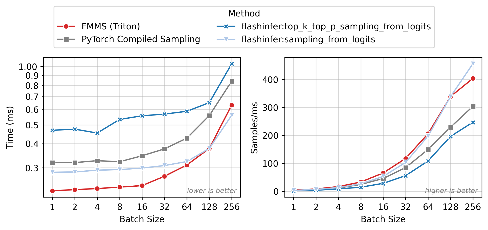{width="100%" #fig-batch-scaling}

## B200
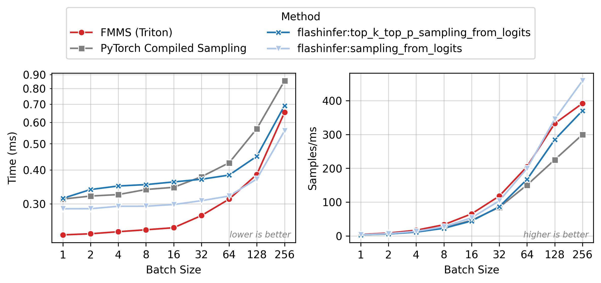{width="100%"}

## H200
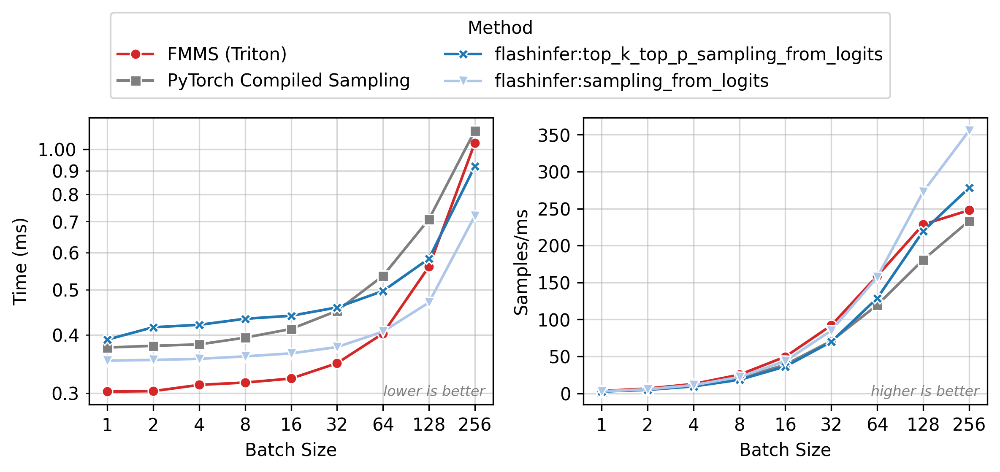{width="100%"}

## H100
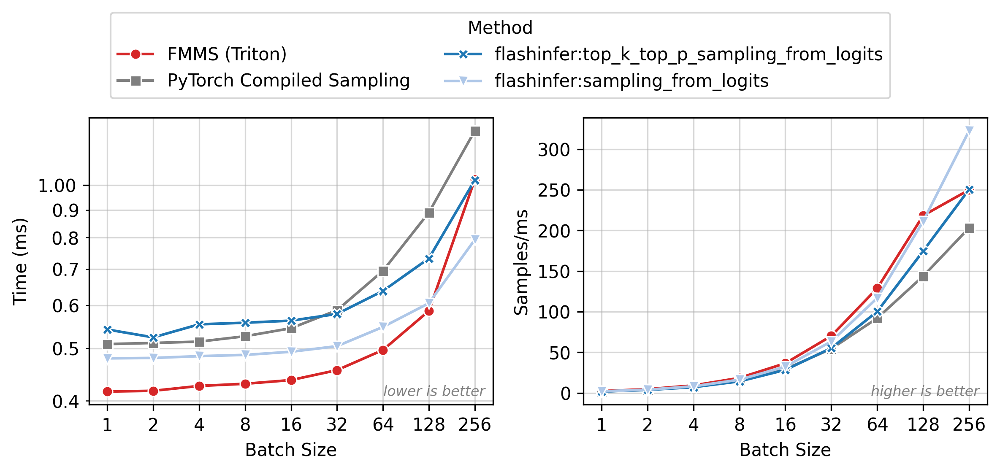{width="100%"}
:::

# Large

::: {.panel-tabset group="gpu"}
## B300
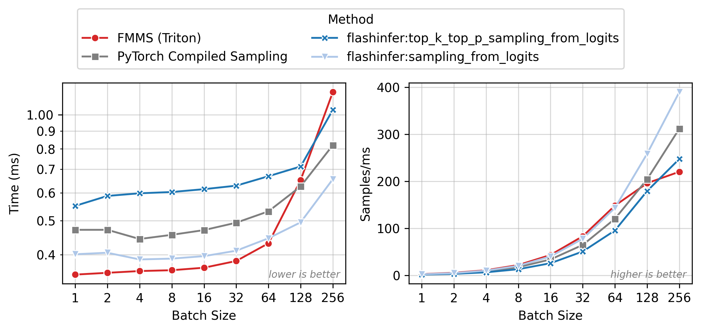{width="100%"}

## B200
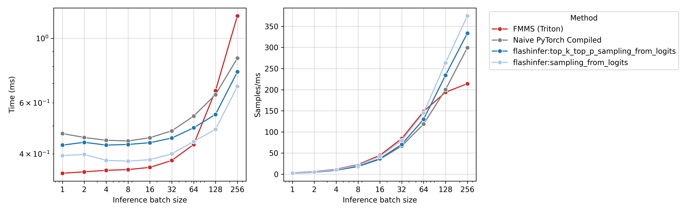{width="100%"}

## H200
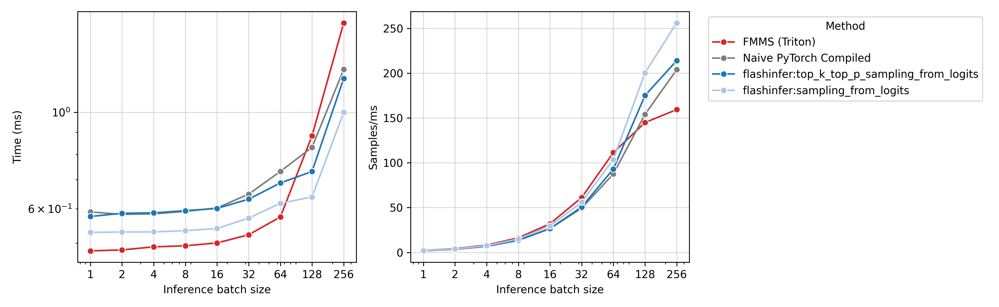{width="100%"}

## H100
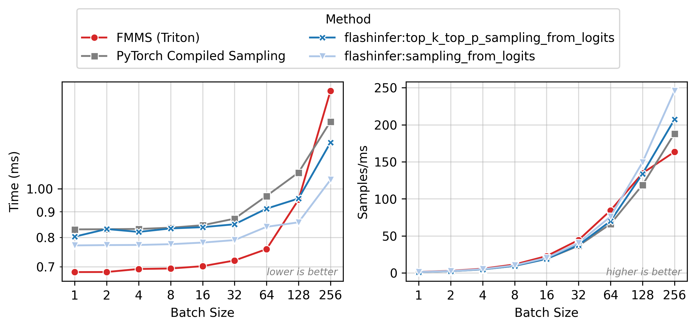{width="100%"}
:::

:::::

*All benchmarks: PyTorch 2.10.0, CUDA 13.0, run on Modal. Data as of 2026-02-11.*

### Relative Performance Across GPUs

The relative speedup tables show `baseline_time / fmms_time`, so values > 1.0 mean FMMS is faster.

::::: {.panel-tabset group="baseline"}
# PyTorch Compiled

This is the sampling path used in vLLM when top-k and top-p are unset (torch compiled matmul + softmax + `torch.multinomial`).

:::: {.panel-tabset group="workload-size"}
### Small

::: {.panel-tabset group="gpu"}
#### B300
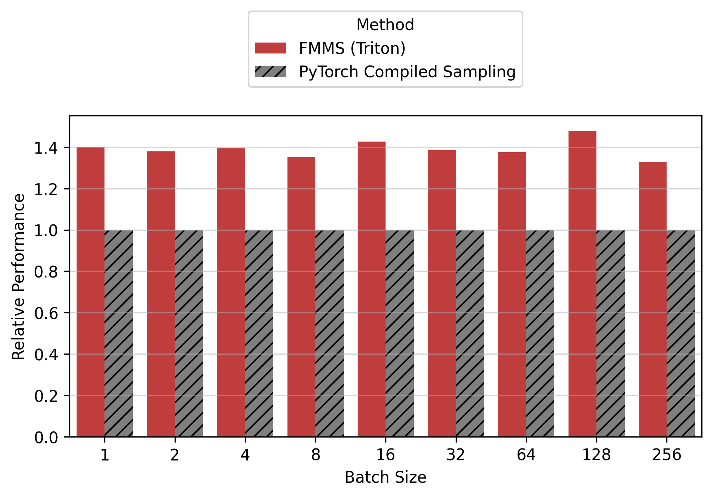{width="80%" #fig-relative-perf-vs-pytorch}

#### B200
{width="80%"}

#### H200
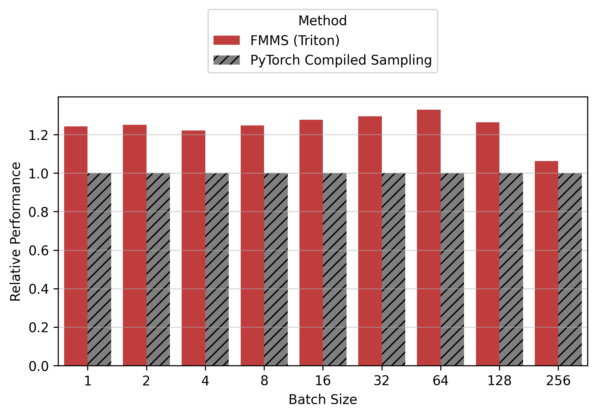{width="80%"}

#### H100
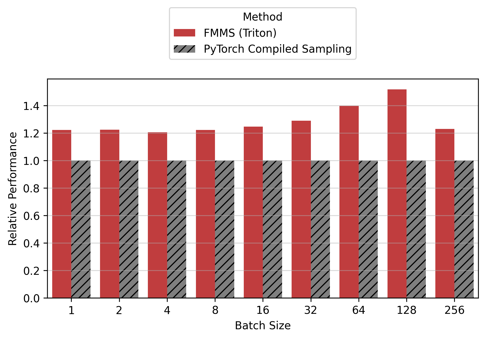{width="80%"}
:::

<details>
<summary>Show data table</summary>

| GPU / Batch Size | 1 | 2 | 4 | 8 | 16 | 32 | 64 | 128 | 256 |
| --- | - | - | - | - | - | - | - | - | - |
| B300 | 1.40 | 1.38 | 1.39 | 1.35 | 1.43 | 1.38 | 1.38 | **1.48** | 1.33 |
| B200 | 1.36 | 1.38 | 1.37 | 1.41 | 1.41 | 1.39 | 1.36 | **1.48** | 1.31 |
| H200 | 1.24 | 1.25 | 1.22 | 1.25 | 1.28 | 1.30 | **1.33** | 1.26 | 1.06 |
| H100 | 1.22 | 1.23 | 1.21 | 1.22 | 1.25 | 1.29 | 1.40 | **1.52** | 1.23 |

: Speedup vs PyTorch Compiled (small config). **Bold** marks the peak speedup per GPU. {.sm .striped}

</details>

### Large

::: {.panel-tabset group="gpu"}
#### B300
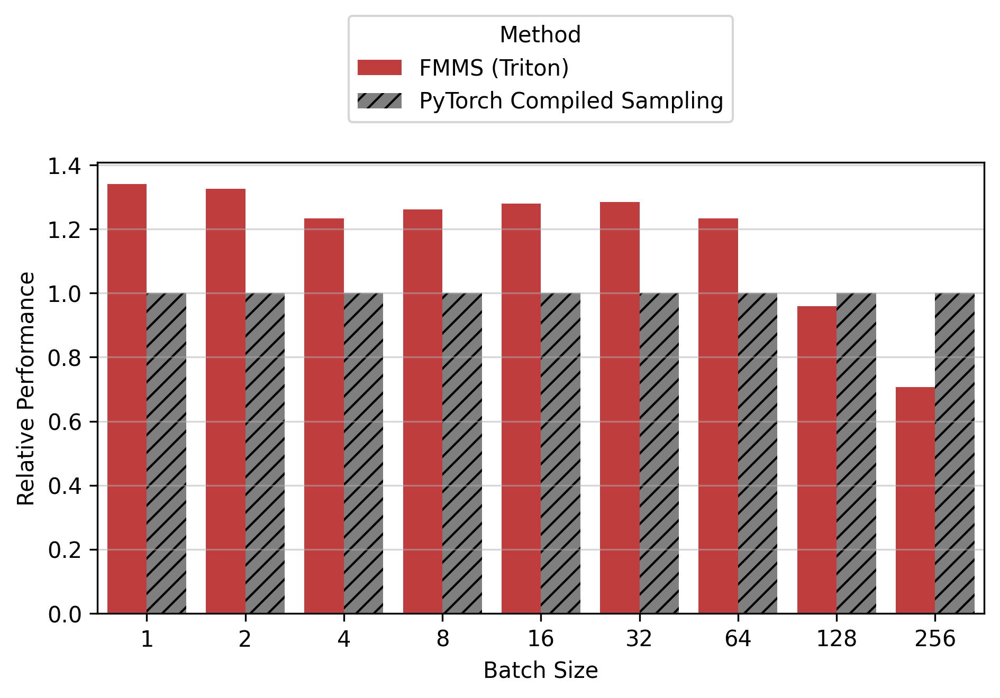{width="80%"}

#### B200
{width="80%"}

#### H200
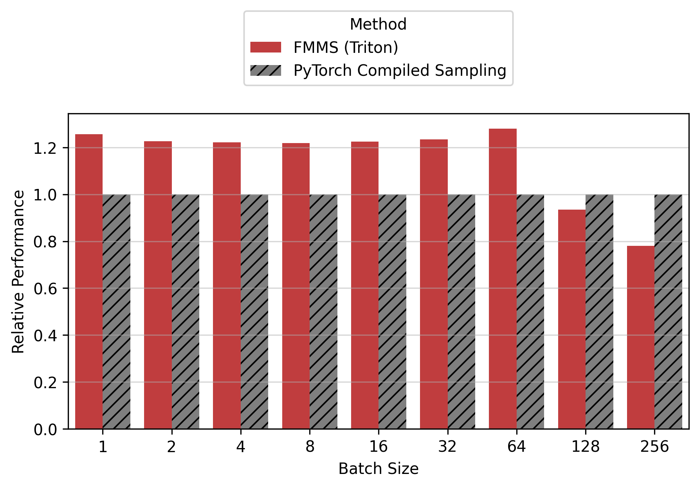{width="80%"}

#### H100
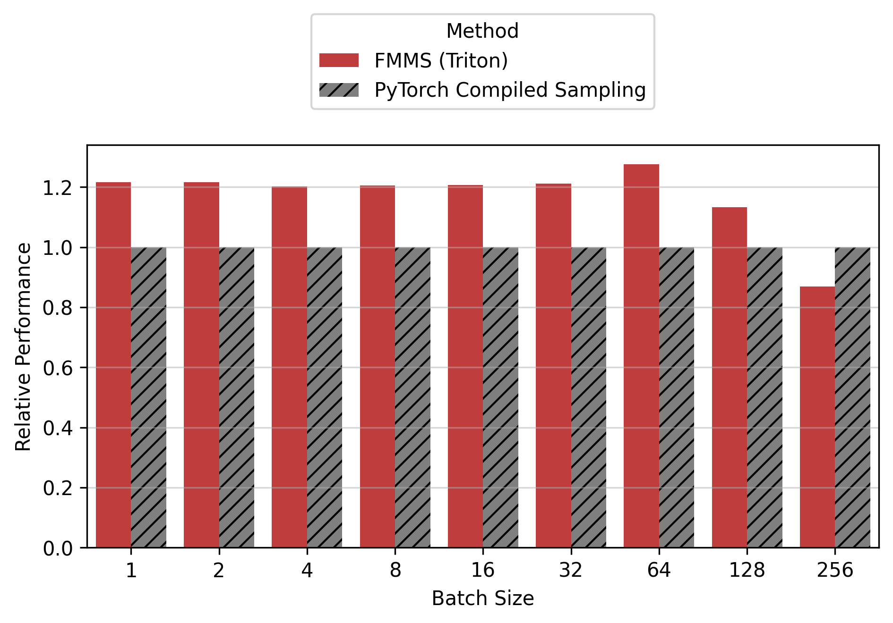{width="80%"}
:::

<details>
<summary>Show data table</summary>

| GPU / Batch Size | 1 | 2 | 4 | 8 | 16 | 32 | 64 | 128 | 256 |
| --- | - | - | - | - | - | - | - | - | - |
| B300 | **1.34** | 1.33 | 1.23 | 1.26 | 1.28 | 1.29 | 1.23 | 0.96 | 0.71 |
| B200 | **1.35** | 1.31 | 1.27 | 1.24 | 1.26 | 1.25 | 1.27 | 0.97 | 0.74 |
| H200 | 1.26 | 1.23 | 1.22 | 1.22 | 1.22 | 1.23 | **1.28** | 0.93 | 0.78 |
| H100 | 1.22 | 1.22 | 1.20 | 1.21 | 1.21 | 1.21 | **1.28** | 1.13 | 0.87 |

: Speedup vs PyTorch Compiled (large config). **Bold** marks the peak speedup per GPU. {.sm .striped}

</details>

::::

For the small config, FMMS is faster at **all batch sizes on all GPUs** (minimum 1.06x on H200 at N=256), with speedups of 6-52%.
The larger vocab (V=151,936) means more logits traffic, making fusion valuable even at high batch sizes.
For the large config, FMMS wins at batch sizes 1-64 (20-35% faster) but regresses at N=128+ on B300/B200/H200.
H100 retains its advantage at larger batch sizes than other GPUs: at N=128, it still achieves 1.13x (large) and 1.52x (small).
This is likely because H100 has the highest ops:byte ratio (295), keeping the matmul memory-bound longer.

# FlashInfer

Two FlashInfer baselines are compared:

* `flashinfer:sampling_from_logits()` is FlashInfer's fastest sampling kernel, but not used in vLLM. It also uses the Gumbel-max trick internally, but operates on pre-materialized logits.
* `flashinfer:top_k_top_p_sampling_from_logits()` is the sampling function used in vLLM when top-k or top-p is set (I set top-k=-1 and top-p=1.0 to disable filtering).

:::: {.panel-tabset group="workload-size"}
### Small

::: {.panel-tabset group="gpu"}
#### B300
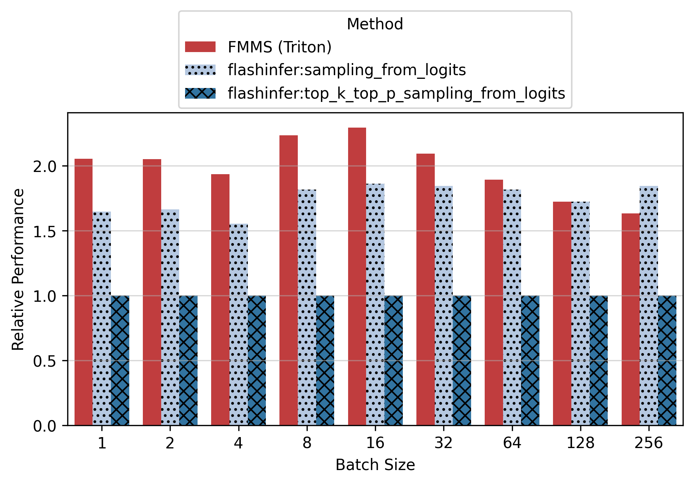{width="80%" #fig-relative-perf-vs-flashinfer}

#### B200
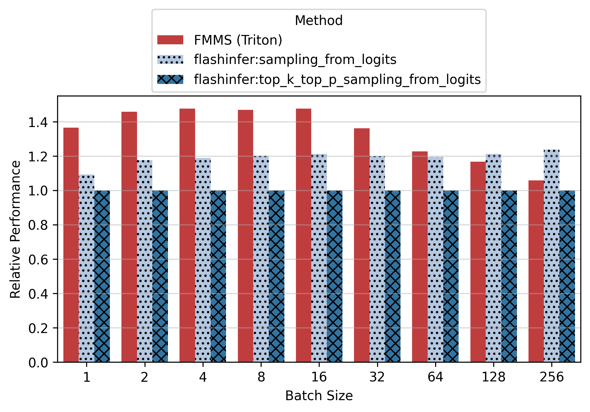{width="80%"}

#### H200
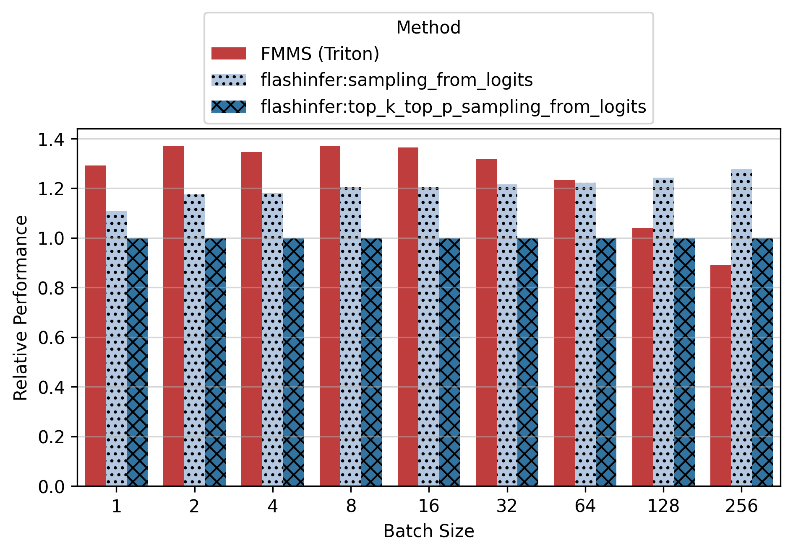{width="80%"}

#### H100
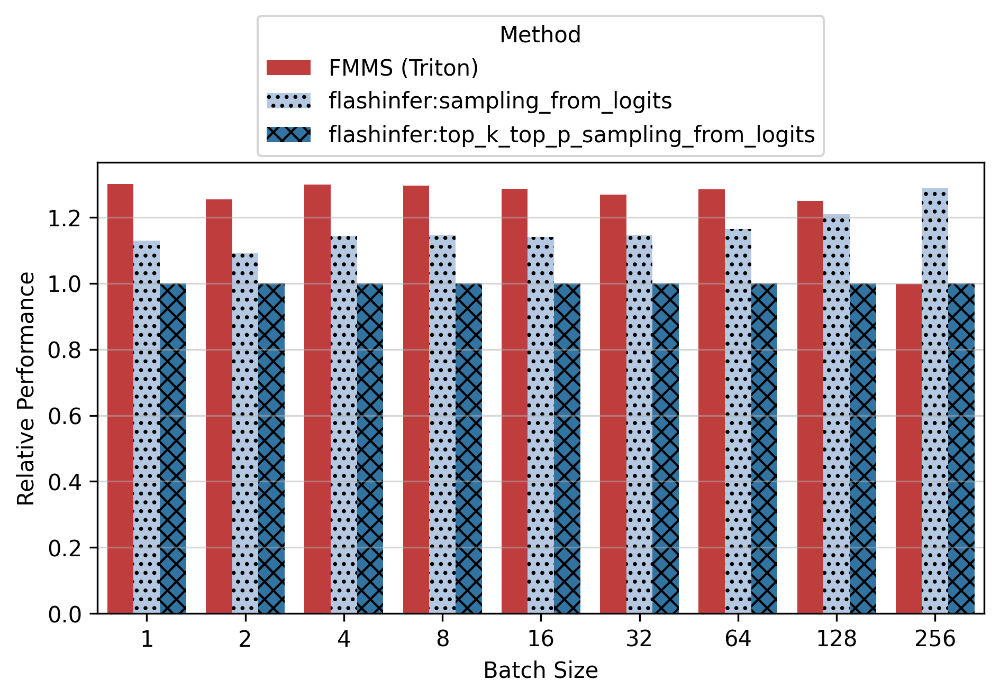{width="80%"}
:::

<details>
<summary>Show data table: vs <code>top_k_top_p</code></summary>

| GPU / Batch Size | 1 | 2 | 4 | 8 | 16 | 32 | 64 | 128 | 256 |
| --- | - | - | - | - | - | - | - | - | - |
| B300 | 2.05 | 2.05 | 1.94 | 2.24 | **2.30** | 2.10 | 1.89 | 1.72 | 1.63 |
| B200 | 1.36 | 1.46 | **1.48** | 1.47 | 1.48 | 1.36 | 1.23 | 1.17 | 1.06 |
| H200 | 1.29 | **1.37** | 1.35 | 1.37 | 1.36 | 1.32 | 1.23 | 1.04 | 0.89 |
| H100 | **1.30** | 1.25 | 1.30 | 1.30 | 1.29 | 1.27 | 1.29 | 1.25 | 1.00 |

: Speedup vs `top_k_top_p` (small config). **Bold** marks the peak speedup per GPU. {.sm .striped}

</details>

<details>
<summary>Show data table: vs <code>sampling_from_logits</code></summary>

| GPU / Batch Size | 1 | 2 | 4 | 8 | 16 | 32 | 64 | 128 | 256 |
| --- | - | - | - | - | - | - | - | - | - |
| B300 | **1.25** | 1.23 | 1.24 | 1.23 | 1.23 | 1.14 | 1.04 | 1.00 | 0.89 |
| B200 | **1.25** | 1.24 | 1.24 | 1.22 | 1.22 | 1.14 | 1.03 | 0.96 | 0.85 |
| H200 | 1.16 | **1.17** | 1.14 | 1.14 | 1.13 | 1.08 | 1.01 | 0.84 | 0.70 |
| H100 | **1.15** | 1.15 | 1.13 | 1.13 | 1.13 | 1.11 | 1.10 | 1.03 | 0.77 |

: Speedup vs `sampling_from_logits` (small config). **Bold** marks the peak speedup per GPU. {.sm .striped}

</details>

### Large

::: {.panel-tabset group="gpu"}
#### B300
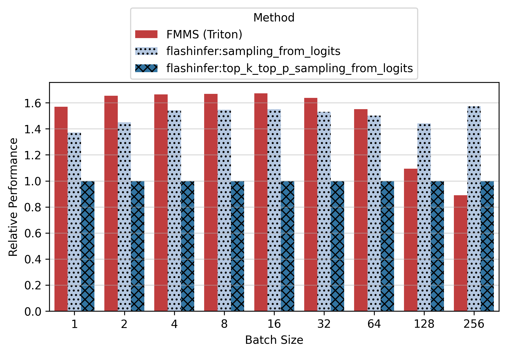{width="80%"}

#### B200
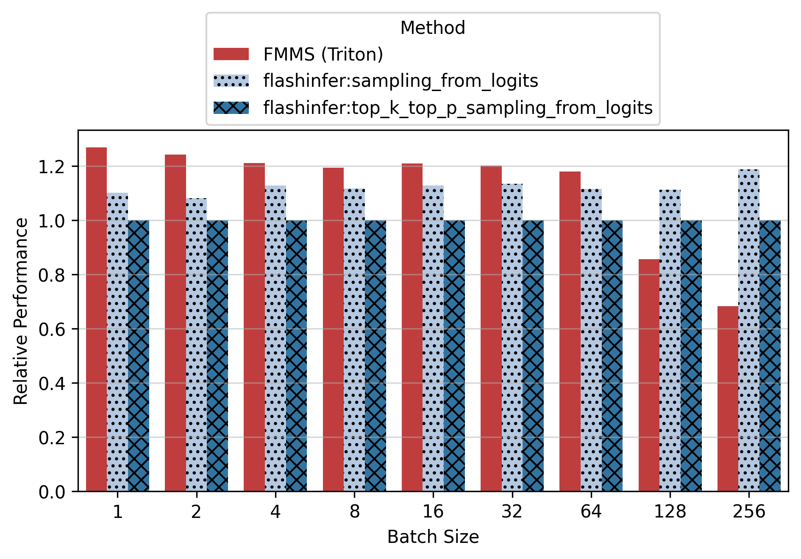{width="80%"}

#### H200
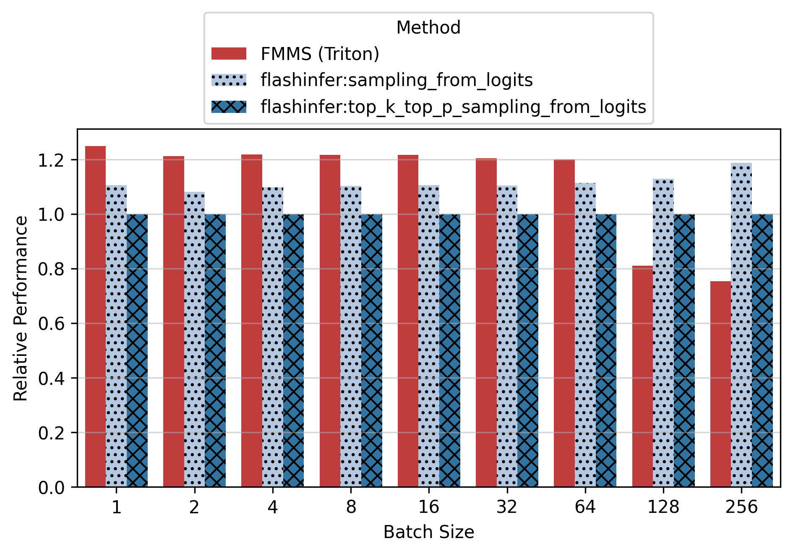{width="80%"}

#### H100
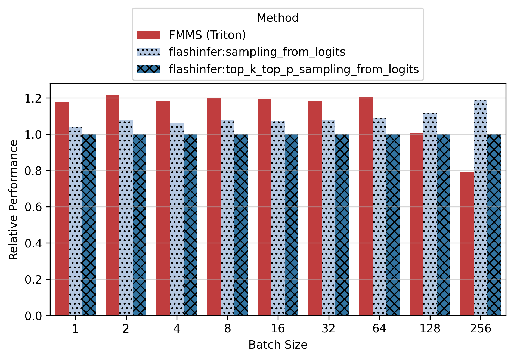{width="80%"}
:::

<details>
<summary>Show data table: vs <code>top_k_top_p</code></summary>

| GPU / Batch Size | 1 | 2 | 4 | 8 | 16 | 32 | 64 | 128 | 256 |
| --- | - | - | - | - | - | - | - | - | - |
| B300 | 1.57 | 1.65 | 1.66 | **1.67** | 1.67 | 1.64 | 1.55 | 1.09 | 0.89 |
| B200 | **1.27** | 1.24 | 1.21 | 1.19 | 1.21 | 1.20 | 1.18 | 0.86 | 0.68 |
| H200 | **1.25** | 1.21 | 1.22 | 1.22 | 1.22 | 1.20 | 1.20 | 0.81 | 0.75 |
| H100 | 1.18 | **1.22** | 1.19 | 1.20 | 1.20 | 1.18 | 1.20 | 1.01 | 0.79 |

: Speedup vs `top_k_top_p` (large config). **Bold** marks the peak speedup per GPU. {.sm .striped}

</details>

<details>
<summary>Show data table: vs <code>sampling_from_logits</code></summary>

| GPU / Batch Size | 1 | 2 | 4 | 8 | 16 | 32 | 64 | 128 | 256 |
| --- | - | - | - | - | - | - | - | - | - |
| B300 | **1.14** | 1.14 | 1.08 | 1.08 | 1.08 | 1.07 | 1.03 | 0.76 | 0.57 |
| B200 | **1.15** | 1.15 | 1.07 | 1.07 | 1.07 | 1.06 | 1.06 | 0.77 | 0.57 |
| H200 | **1.13** | 1.12 | 1.11 | 1.10 | 1.10 | 1.09 | 1.08 | 0.72 | 0.63 |
| H100 | **1.13** | 1.13 | 1.12 | 1.12 | 1.11 | 1.10 | 1.11 | 0.90 | 0.67 |

: Speedup vs `sampling_from_logits` (large config). **Bold** marks the peak speedup per GPU. {.sm .striped}

</details>

::::

Vs `top_k_top_p`, FMMS is up to **2.30x faster** (B300, small config, N=16).
For the small config on B300, FMMS is 1.63-2.30x faster across all batch sizes.
B300 is a striking outlier: 1.6-2.3x speedups while B200/H200/H100 show 1.2-1.5x.
B200 and B300 have identical bandwidth and compute specs, and FMMS runs at the same speed on both (within 2%).
The gap is entirely because FlashInfer's `top_k_top_p` is ~35% slower on B300 than on B200, likely due to incomplete optimization for the newer B300 architecture (sm_110).

Vs `sampling_from_logits`, **FMMS is faster at all batch sizes from 1 to 64 on every GPU tested**, with speedups of 3-25%.
For the small config, FMMS stays above 1.0x up to N=128 on B300/H100.
For the large config, it regresses at N=128+ on most GPUs.
:::::

## Roofline Analysis

The benchmarks above show a clear crossover: FMMS wins at small batch sizes and regresses at large ones.
The explanation lies in the **arithmetic intensity** of the matmul. The matmul $W_{[V, d]} \times H_{[N, d]}^T$ has:

$$
\text{Arithmetic Intensity} = \frac{\text{FLOPs}}{\text{Bytes}} = \frac{2 \cdot V \cdot d \cdot N}{2 \cdot V \cdot d} = N
$$

The weight matrix $W$ dominates the memory traffic ($V \cdot d$ elements, each read once), and the hidden states are negligible when $N \ll V$[^hidden-states-negligible]. So the arithmetic intensity is simply $N$: each byte of weights loaded produces $N$ multiply-adds.

[^hidden-states-negligible]: Even at the largest benchmarked batch size (N=256) with the small config (V=151,936, d=4,096), the hidden states are 256 $\times$ 4,096 $\times$ 2 bytes = 2 MB versus 1.17 GB for the weight matrix (0.17%). The exact arithmetic intensity is $N \cdot V / (V + N)$ = 255.57, versus the approximation of 256.

A GPU becomes compute-bound when the arithmetic intensity exceeds its **ops:byte ratio** (peak compute / peak memory bandwidth). For the H100:

$$
\text{ops:byte} = \frac{989 \text{ TFLOP/s (BF16)}}{3.35 \text{ TB/s (HBM3)}} \approx 295
$$

The roofline plot in @fig-roofline confirms this: all methods track the memory-bound slope up to N=64, then flatten as they approach the compute ceiling.
Each point is labeled with its batch size.
FMMS sits slightly above the baselines in the memory-bound region, reflecting its bandwidth savings from avoiding the logits round-trip.

::::: {.panel-tabset group="workload-size"}
### Small
::: {.panel-tabset group="gpu"}
# B300
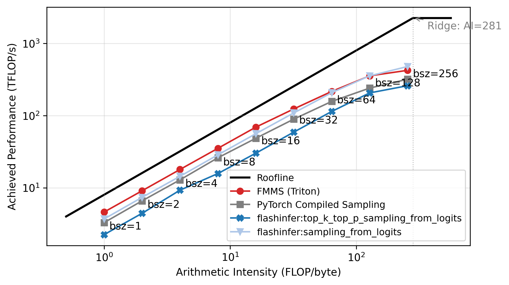{width="85%" #fig-roofline}

# B200
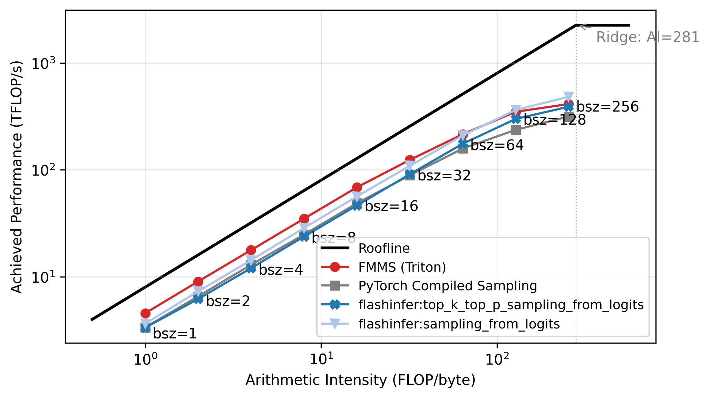{width="85%"}

# H200
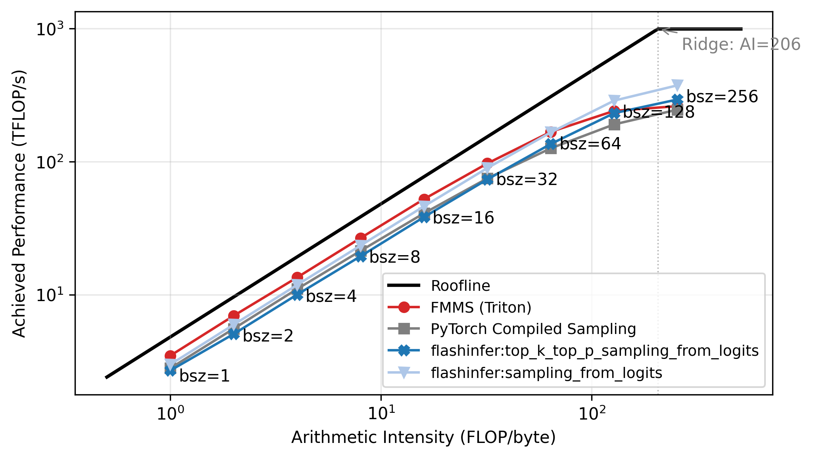{width="85%"}

# H100
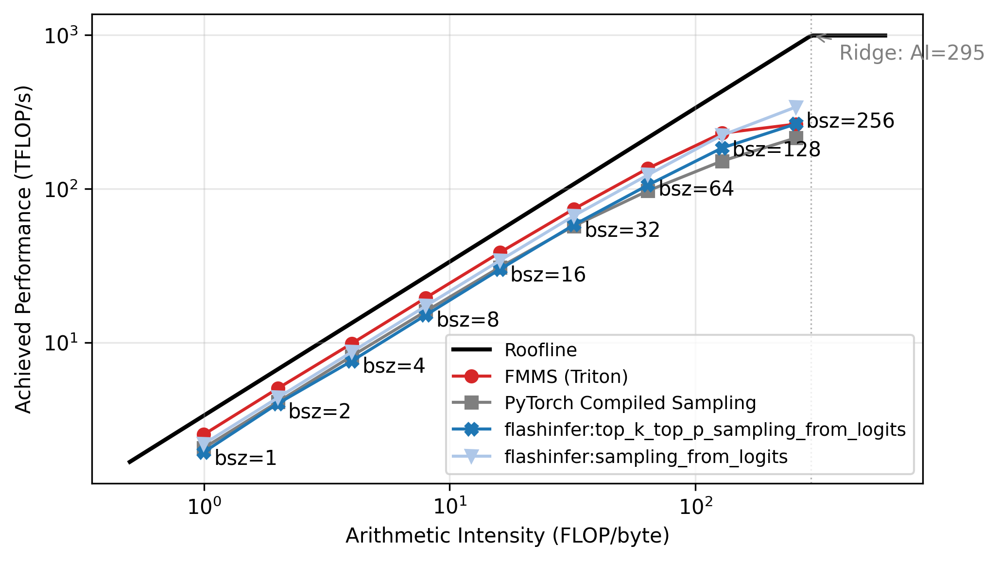{width="85%"}
:::
### Large
::: {.panel-tabset group="gpu"}
# B300
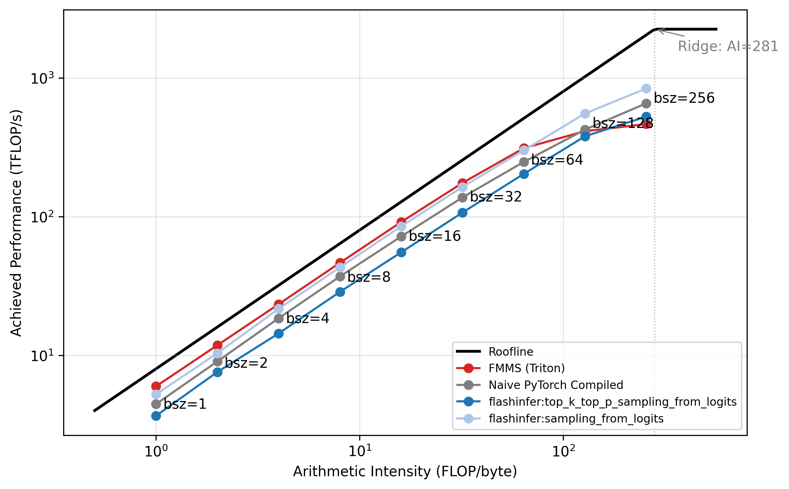{width="85%"}

# B200
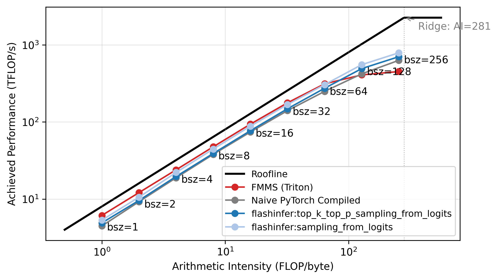{width="85%"}

# H200
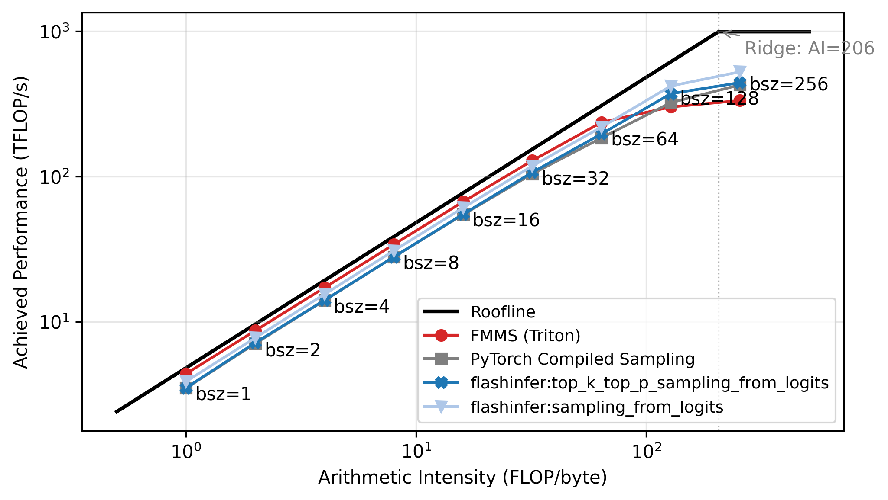{width="85%"}

# H100
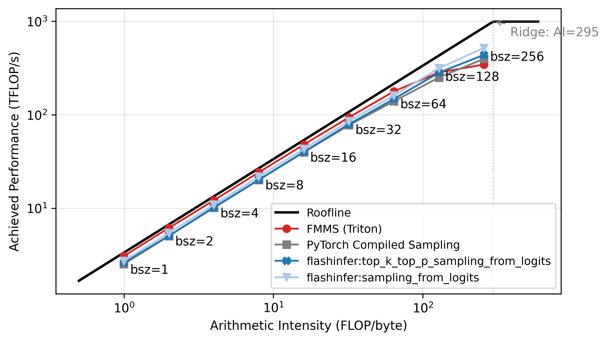{width="85%"}
:::
::::

### Memory Throughput

@fig-memory-throughput shows the achieved memory throughput (GB/s) as a function of batch size.
At low batch sizes (N $\leq$ 64), where the operation is deeply memory-bound, FMMS consistently achieves higher throughput than all baselines.
Peak SoL varies by GPU and config: up to ~90% on H100/H200 (large config), ~55-60% on B300/B200 (small config).
100% would mean the kernel does nothing but stream the weight matrix from GMEM at the hardware's maximum rate, with zero overhead for computation, synchronization, or memory access patterns.
This is the direct mechanism behind the speedups: by fusing the matmul and sampling, FMMS uses the available memory bandwidth more efficiently.

::::: {.panel-tabset group="workload-size"}
### Small
::: {.panel-tabset group="gpu"}
# B300
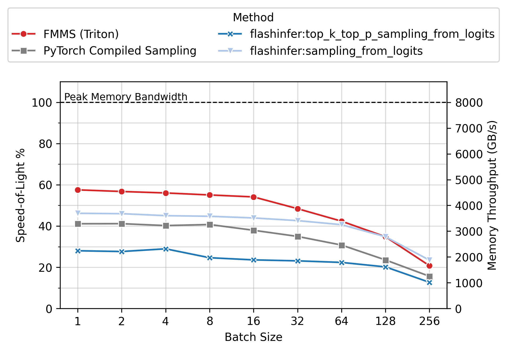{width="85%" #fig-memory-throughput}

# B200
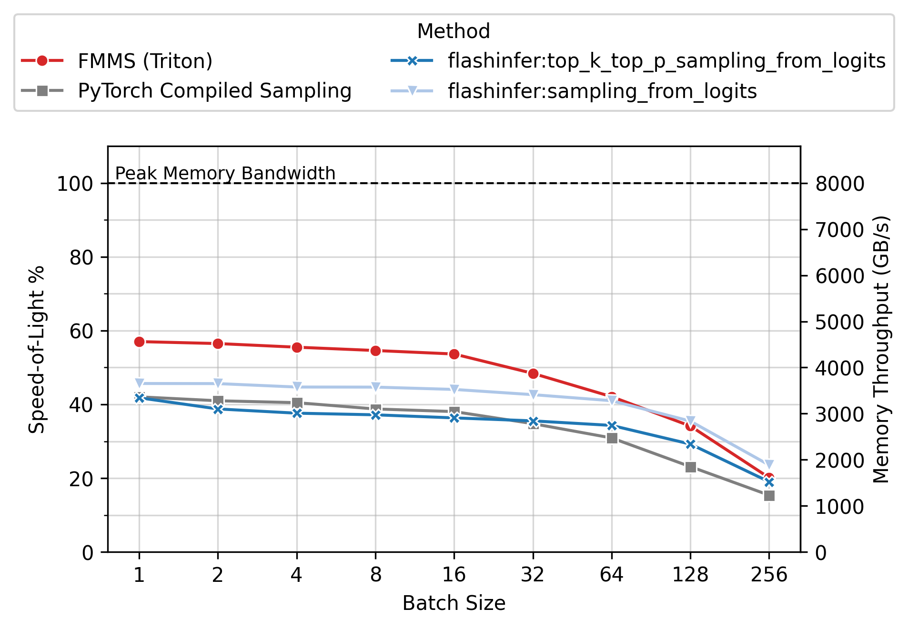{width="85%"}

# H200
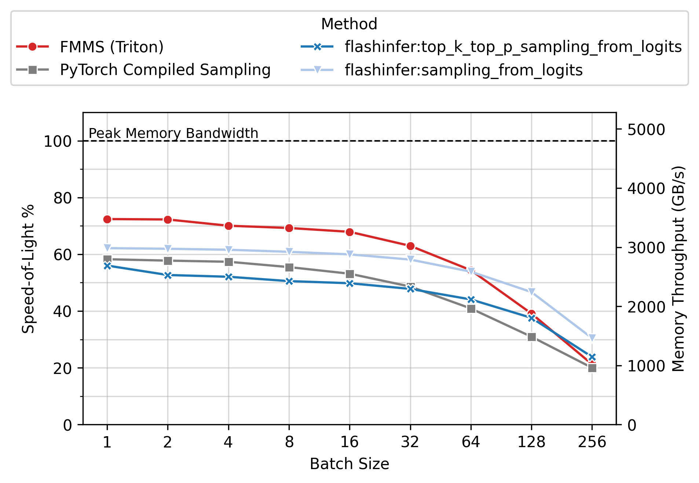{width="85%"}

# H100
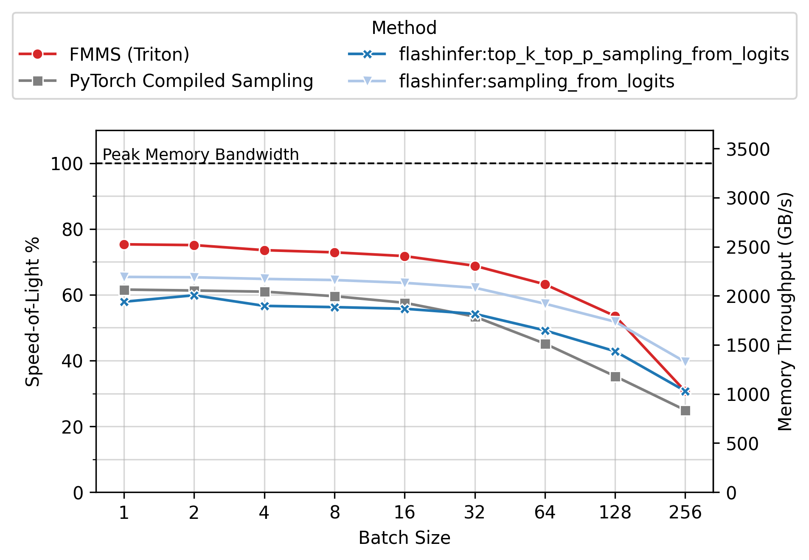{width="85%"}
:::
### Large
::: {.panel-tabset group="gpu"}
# B300
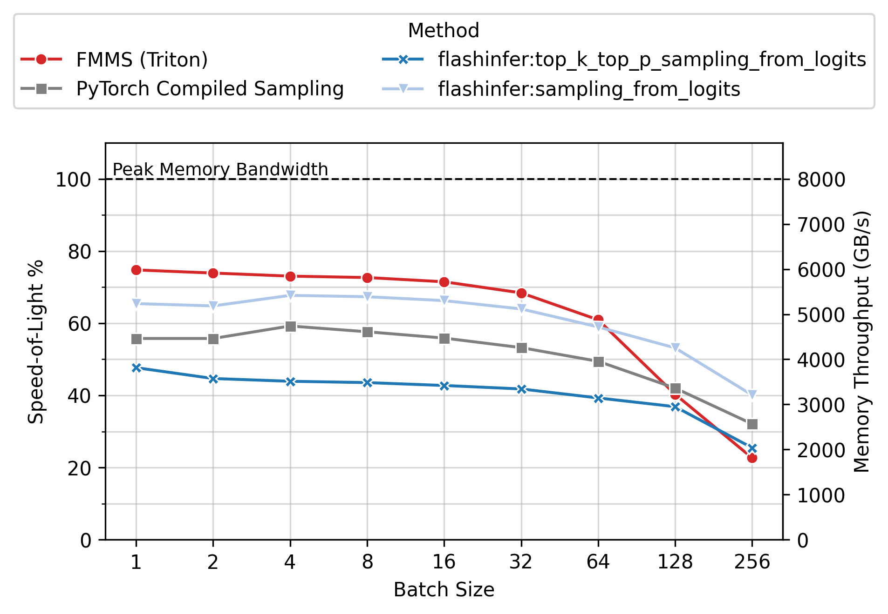{width="85%"}

# B200
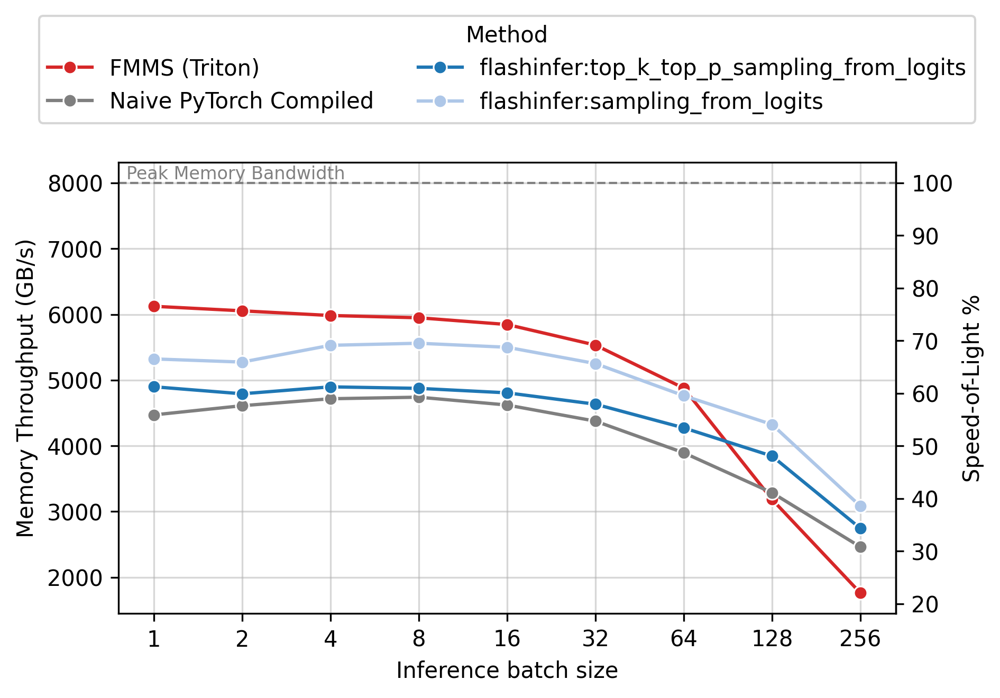{width="85%"}

# H200
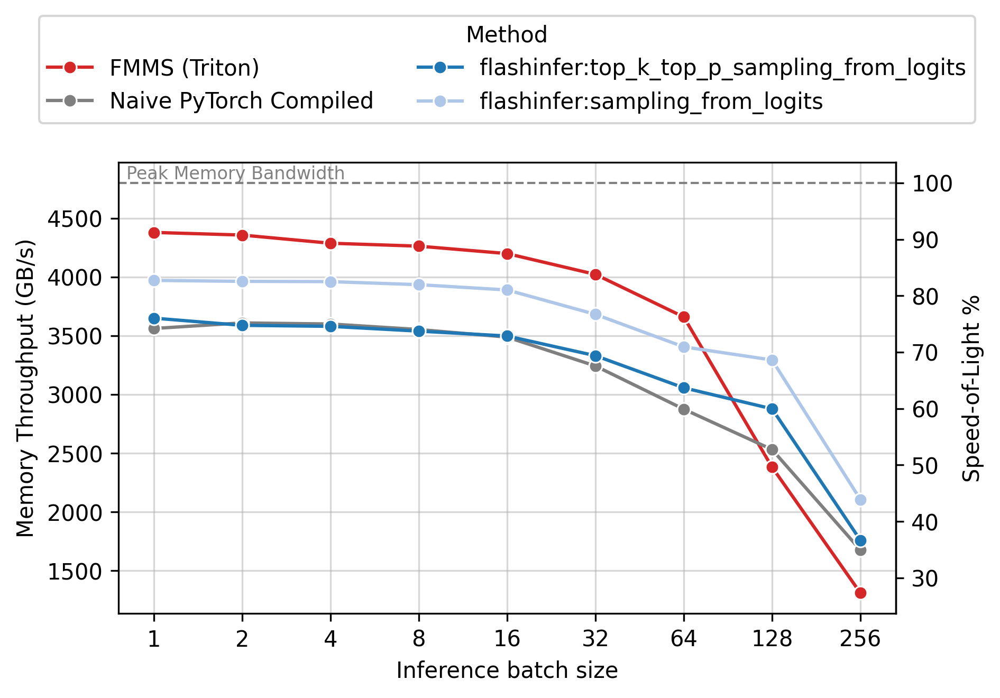{width="85%"}

# H100
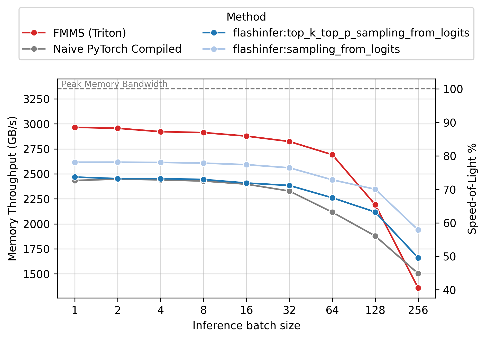{width="85%"}
:::
::::

### Takeaway

| $N$ | Regime on H100 (ridge = 295) |
| - | - |
| 1 | Memory-bound (295x below ridge) |
| 32 | Memory-bound (9x below) |
| 64 | Memory-bound (5x below) |
| 295 | Crossover to compute-bound |

: {.sm}

**When memory-bound**, the kernel's throughput is determined by how fast it reads the weight matrix from GMEM. FMMS wins here because it reads the weights **once** and performs both the matmul and sampling in-kernel. The unfused baselines read the weights for the matmul, write logits to GMEM, then read them back for sampling. This extra round-trip wastes bandwidth on the bottleneck path.

**When compute-bound**, the matmul dominates runtime and the cost of the extra GMEM traffic for logits becomes negligible relative to the computation. 
The baselines can use highly optimized matmul implementations (cuBLAS via `torch.compile`), while FMMS implements the matmul in Triton.
It also suffers from higher register pressure, because it fuses Gumbel noise generation and the max-reduction into the same kernel.

The theoretical crossover is the GPU's ops:byte ratio (the ridge point in @fig-roofline): 295 for H100, 281 for B300/B200, 206 for H200.
In practice, the transition is gradual: @fig-memory-throughput shows that achieved throughput already drops at N=128, well before the ridge point.
This is why FMMS loses its advantage at large batch sizes despite still being "memory-bound" in roofline terms.
The sweet spot for FMMS is the typical LLM decode regime (N $\leq$ 64), where the operation is deeply memory-bound and fusion pays off the most.

## End-to-End Benchmarks (vLLM)

The kernel benchmarks measure the FMMS kernel in isolation.
To measure end-to-end impact, I integrated FMMS into vLLM ([branch](https://github.com/tomasruizt/vllm/tree/feature/fmms-sampler)) and benchmarked median time per output token (TPOT) across concurrency levels using `vllm bench sweep`.
I chose three models spanning different sizes and architectures.
The LM head is a standard dense linear layer in all three, so FMMS applies identically regardless of MoE routing.

| Model | Type | Hidden size (d) | Vocab size (V) |
| - | --- | - | - |
| gpt-oss-120b | MoE (128 experts, 4 active) | 2,880 | 201,088 |
| Qwen3-1.7B | Dense | 2,048 | 151,936 |
| Qwen3-8B | Dense | 4,096 | 152,064 |
| Qwen3-32B | Dense | 5,120 | 152,064 |

: {.sm}

Each configuration is run 5 times per trial; some models have 2 independent trials to increase confidence.
The plots pool data from all trials, and per-trial tables are available in the collapsible sections.
All results are on a B200 GPU with PyTorch 2.10.0 and CUDA 13.0, run on Modal.

:::: {.panel-tabset group="vllm-model"}
# gpt-oss-120b

The LM head is a smaller fraction of the total decode step in a 120B-parameter model.
FMMS reduces TPOT by up to 5% at low concurrency (1-8), with modest 1-2% improvements at higher concurrency levels.

::: {layout-ncol=2}
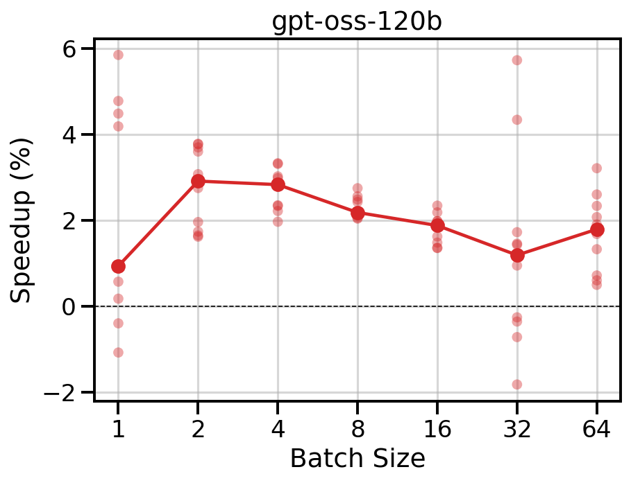

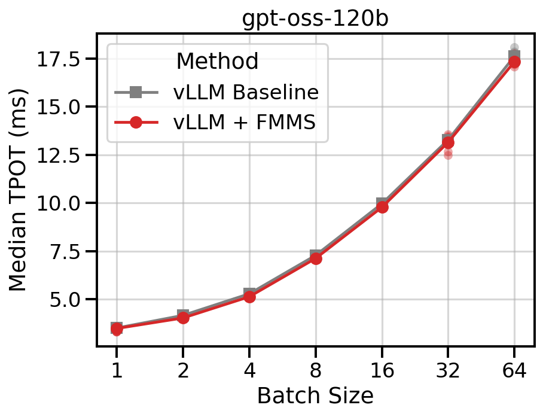
:::

<details>
<summary>Data table</summary>

::: {.panel-tabset}
## Trial 1

| Concurrency | Baseline (ms) | FMMS Triton (ms) | TPOT Reduction |
| - | - | - | - |
| 1 | 3.45 | 3.29 | **-4.6%** |
| 2 | 4.14 | 3.99 | -3.6% |
| 4 | 5.28 | 5.11 | -3.2% |
| 8 | 7.30 | 7.12 | -2.5% |
| 16 | 9.94 | 9.77 | -1.7% |
| 32 | 13.34 | 13.39 | +0.4% |
| 64 | 17.80 | 17.50 | -1.7% |

: Median TPOT on gpt-oss-120b, trial 1. **Bold** marks the peak reduction. {.sm .striped}

## Trial 2

| Concurrency | Baseline (ms) | FMMS Triton (ms) | TPOT Reduction |
| - | - | - | - |
| 1 | 3.54 | 3.53 | -0.3% |
| 2 | 4.17 | 4.11 | -1.4% |
| 4 | 5.28 | 5.15 | **-2.5%** |
| 8 | 7.27 | 7.12 | -2.1% |
| 16 | 9.97 | 9.79 | -1.8% |
| 32 | 13.23 | 13.03 | -1.5% |
| 64 | 17.52 | 17.24 | -1.6% |

: Median TPOT on gpt-oss-120b, trial 2. **Bold** marks the peak reduction. {.sm .striped}

:::

</details>

# Qwen3-1.7B

The small hidden dimension makes the LM head matmul strongly memory-bound, so fusion has a large impact.
FMMS reduces TPOT by 11-19% across all concurrency levels.

::: {layout-ncol=2}
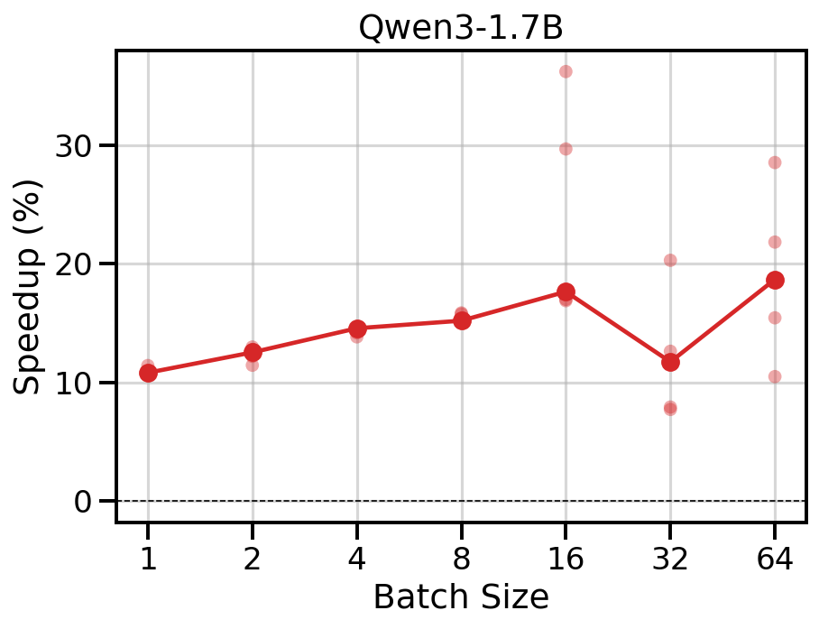

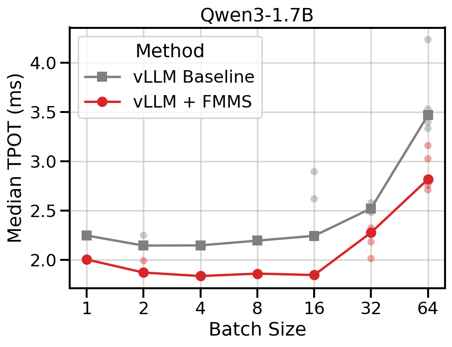
:::

<details>
<summary>Data table</summary>

| Concurrency | Baseline (ms) | FMMS Triton (ms) | TPOT Reduction |
| - | - | - | - |
| 1 | 2.25 | 2.00 | -10.8% |
| 2 | 2.14 | 1.87 | -12.5% |
| 4 | 2.15 | 1.84 | -14.6% |
| 8 | 2.19 | 1.86 | -15.2% |
| 16 | 2.24 | 1.85 | -17.7% |
| 32 | 2.52 | 2.28 | -11.7% |
| 64 | 3.47 | 2.82 | **-18.7%** |

: Median TPOT on Qwen3-1.7B. **Bold** marks the peak reduction. {.sm .striped}

</details>

# Qwen3-8B

FMMS reduces TPOT by 3-7% consistently across concurrency levels.

::: {layout-ncol=2}
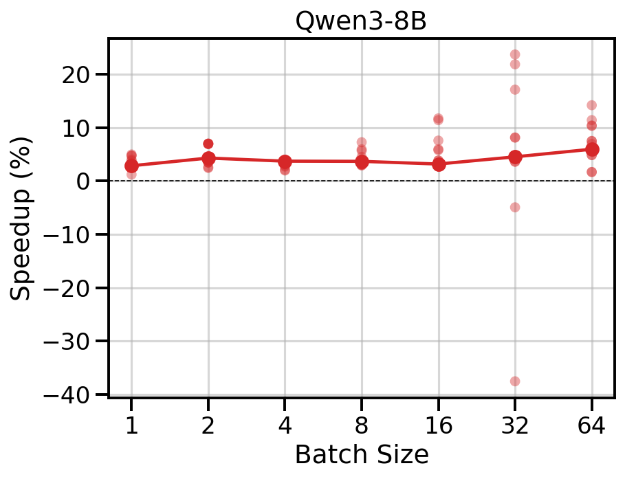

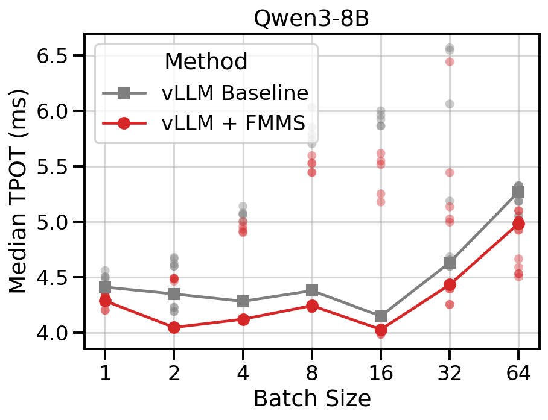
:::

<details>
<summary>Data table</summary>

::: {.panel-tabset}
## Trial 1

| Concurrency | Baseline (ms) | FMMS Triton (ms) | TPOT Reduction |
| - | - | - | - |
| 1 | 4.50 | 4.34 | -3.8% |
| 2 | 4.63 | 4.49 | -3.5% |
| 4 | 5.07 | 4.93 | -2.7% |
| 8 | 5.79 | 5.53 | -5.6% |
| 16 | 5.93 | 5.52 | -7.5% |
| 32 | 6.06 | 5.14 | **-17.1%** |
| 64 | 5.06 | 4.53 | -10.4% |

: Median TPOT on Qwen3-8B, trial 1. **Bold** marks the peak reduction. {.sm .striped}

## Trial 2

| Concurrency | Baseline (ms) | FMMS Triton (ms) | TPOT Reduction |
| - | - | - | - |
| 1 | 4.41 | 4.29 | -2.8% |
| 2 | 4.35 | 4.05 | **-6.9%** |
| 4 | 4.28 | 4.12 | -3.7% |
| 8 | 4.38 | 4.22 | -3.6% |
| 16 | 4.15 | 4.02 | -2.9% |
| 32 | 4.63 | 4.43 | -4.5% |
| 64 | 5.29 | 5.01 | -5.7% |

: Median TPOT on Qwen3-8B, trial 2. **Bold** marks the peak reduction. {.sm .striped}

:::

</details>

### Quirks of E2E Benchmarking

The two trials show substantial variability in absolute runtimes.
At concurrency 32, trial 1 measures 6.06 ms (baseline) vs 5.14 ms (FMMS), while trial 2 measures 4.63 ms vs 4.43 ms.
Despite this, the pattern is consistent: FMMS outperforms the baseline at every concurrency level in both trials.

At concurrency 256 (not shown in the tables above), both variants degrade sharply, but the baseline degrades much more.
In trial 1, the baseline jumps to 27.73 ms while FMMS reaches 19.61 ms (29% reduction).
In trial 2, the baseline reaches 15.52 ms and FMMS 12.68 ms (19% reduction).
The LM head is only a fraction of the total decode step, so the kernel-level speedup (1.3x in microbenchmarks at N=256) cannot explain a 19-29% end-to-end TPOT improvement.
My main hypothesis is that vLLM's baseline sampling path launches kernels outside the main CUDA graph, incurring overhead that compounds at high batch sizes.
FMMS replaces this with a single fused Triton kernel, avoiding that overhead entirely.

# Qwen3-32B

FMMS reduces TPOT by 1-2% across concurrency levels.

::: {layout-ncol=2}
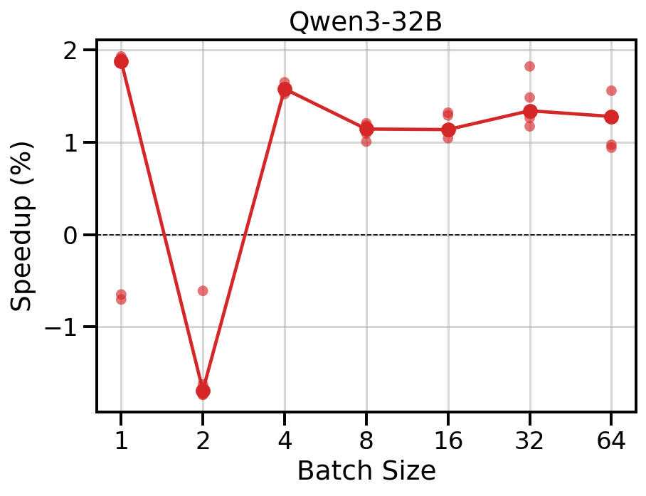

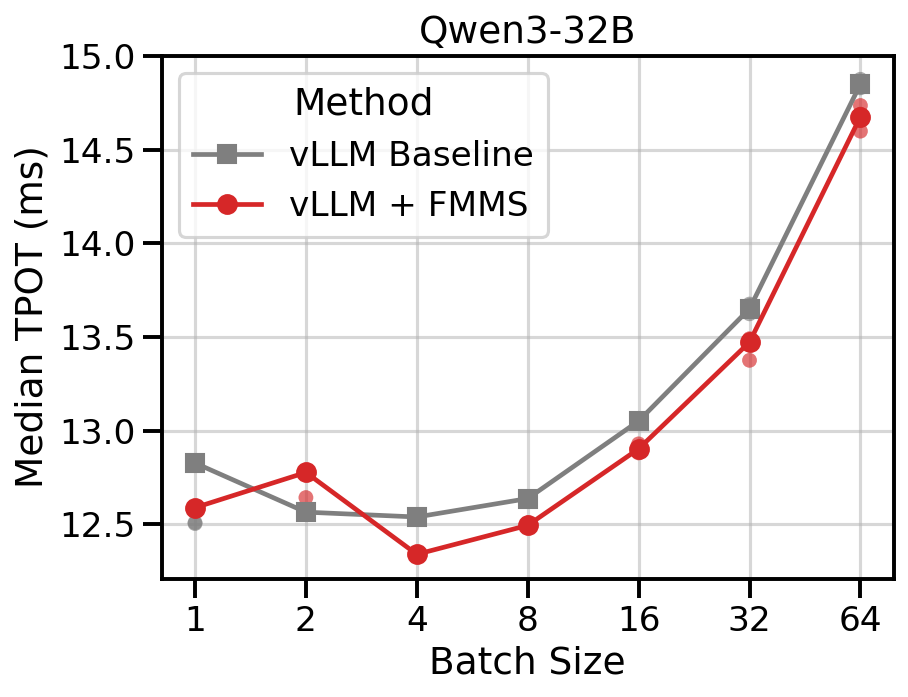
:::

<details>
<summary>Data table</summary>

| Concurrency | Baseline (ms) | FMMS Triton (ms) | TPOT Reduction |
| - | - | - | - |
| 1 | 12.83 | 12.59 | -1.9% |
| 2 | 12.56 | 12.78 | +1.7% |
| 4 | 12.54 | 12.34 | -1.6% |
| 8 | 12.64 | 12.49 | -1.1% |
| 16 | 13.05 | 12.90 | -1.1% |
| 32 | 13.65 | 13.47 | -1.3% |
| 64 | 14.85 | 14.68 | -1.3% |

: Median TPOT on Qwen3-32B. {.sm .striped}

</details>
::::

## Correctness

FMMS uses the Gumbel-max trick, which produces **exact** samples from the categorical distribution, not an approximation.
But because the output is stochastic, correctness is harder to verify than for a deterministic kernel.
You cannot compare the output to a reference value; instead, you need statistical tests that verify the output *distribution* is correct.

I verify this with a chi-squared goodness-of-fit test that runs as a regular unit test during development: draw 10,000 samples from the kernel using synthetic inputs with known logit vectors, and compare the empirical token frequencies against the theoretical softmax probabilities.
The test is parametrized over multiple vocabulary sizes and batch sizes to catch tile-boundary edge cases.

### End-to-End: GSM8K

As an end-to-end quality check, I integrated FMMS into vLLM and ran the GSM8K benchmark (1,319 questions, 0-shot chain-of-thought) via [lm-evaluation-harness](https://github.com/EleutherAI/lm-evaluation-harness) on Qwen3-1.7B.
Answers were graded by an LLM judge.

| Variant | Accuracy | 95% CI |
| --- | - | - |
| Baseline (vLLM default) | 89.6% | [87.9%, 91.2%] |
| FMMS Triton | 89.4% | [87.7%, 91.0%] |

: GSM8K accuracy on Qwen3-1.7B {.sm}

To test whether this 0.2 percentage point difference is meaningful, I use a paired bootstrap test (10,000 resamples).
The test is *paired* because both variants answer the same 1,319 questions: it computes per-question differences (correct vs. incorrect), then bootstraps the mean difference.
This cancels out shared question difficulty and focuses on questions where the variants actually disagree.
The result is p=0.776, far from significant (threshold: p < 0.05), confirming that FMMS does not degrade model accuracy.

## The Algorithm

The matmul $W_{[V,d]} \times H_{[N,d]}^T$ is tiled across the $V$, $d$, and $N$ dimensions as shown in @fig-tiled-mm.
Each tile produces a $(T_V, T_N)$ block of logits in SRAM.

{width="60%" text-align="left" fig-alt="Tiling the computation of the logits" .lightbox #fig-tiled-mm}

Since argmax decomposes over tiles (as described above), the kernel has a two-stage design:

* **Stage 1 (Triton kernel):** A 2D grid of programs indexed by `(v, h)` (vocabulary tile, batch tile). Each program computes its logit tile, scales by temperature, adds Gumbel noise, and writes only the local max value and vocabulary index to GMEM.
* **Stage 2 (host-side reduction):** A cheap PyTorch reduction over the `num_V_tiles` local maxima per hidden state:

```python
best_tiles = tile_maxs.argmax(dim=0)   # which tile won?
samples = tile_indices.gather(0, best_tiles)  # what index did it have?
```

## Related Work

_Cut Your Losses in Large-Vocabulary Language Models_ [@wijmans2025cut] is the direct inspiration for this work.
They avoid materializing logits during training by computing the cross-entropy loss incrementally on SRAM, reducing memory from 24GB to 1MB for Gemma 2 (2B).
FMMS extends this idea to inference, where the challenge shifts from loss computation to sampling.

_FlashSampling_ [@qin2025flashsampling] presents a conceptually similar algorithm for fused sampling.
The paper was submitted to ICLR 25 but rejected due to weak justification and experimental evidence.
This post presents comprehensive benchmarks against strong baselines across multiple GPUs.

_FlashInfer_ [@ye2025flashinfer] provides high-performance sampling kernels used in vLLM [@DBLP:conf/sosp/KwonLZ0ZY0ZS23] and SGLang [@zheng2024sglang], but all its sampling functions take pre-materialized logits or probabilities as input.
_Liger Kernel_ [@hsu2025ligerkernelefficienttriton] focuses on training-time kernel fusion and includes no sampling primitives.
The _online-softmax_ method [@milakov2018onlinenormalizercalculationsoftmax] enables incremental normalization and is used in _FlashAttention_ [@dao2022flashattention], but neither applies it to sampling from the LM head.

## Conclusion

FMMS demonstrates that fusing matrix multiplication with sampling via the Gumbel-max trick is both correct and practical.
In kernel microbenchmarks, FMMS outperforms every baseline on every GPU tested at batch sizes 1 to 64: 2-15% faster than the fastest baseline (FlashInfer `sampling_from_logits`) and 19-37% faster than PyTorch compiled sampling.
These are the batch sizes that matter most for LLM decode, where the operation is memory-bound and eliminating the extra GMEM round-trip for logits directly improves throughput.

These gains translate to real-world speedups: integrated into vLLM, FMMS reduces median TPOT by 10-19% on Qwen3-1.7B, 3-29% on Qwen3-8B, and 2-4% on gpt-oss-120b, with no degradation in model accuracy (verified on GSM8K).

The approach has clear limitations: at large batch sizes where the matmul becomes compute-bound, baseline approaches with optimized cuBLAS matmuls are faster.
This is a fundamental trade-off, as fusion saves memory bandwidth at the cost of matmul efficiency.

The code is open-source and available at [github.com/tomasruizt/fused-mm-sample](https://github.com/tomasruizt/fused-mm-sample).

# References
